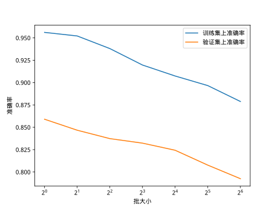

# 作业 1：线性模型和支持向量机

## 2 线性模型与梯度下降 (50pt+2pt)

### 2.1 特征归一化 (4pt)

#### 2.1.1 补全函数 `split_data`，将数据集划分为训练集和测试集。

```python
X_list.append(X[: int(num_instances * split_size[0])])
X_list.append(X[int(num_instances * split_size[0]) :])
y_list.append(y[: int(num_instances * split_size[0])])
y_list.append(y[int(num_instances * split_size[0]) :])
return X_list, y_list
```

#### 2.1.2 补全函数 `feature_normalization`，实现特征的归一化。

```python
train_normalized = (train - np.min(train, axis=0)) / (np.max(train, axis=0) - np.min(train, axis=0))
test_normalized = (test - np.min(train, axis=0)) / (np.max(train, axis=0) - np.min(train, axis=0))
return train_normalized, test_normalized
```

### 2.2 目标函数与梯度 (10pt)

#### 2.2.1 将训练数据的特征记作 $X=(x_1,x_2,\dots,x_m)^T\in\mathbb{R}^{m\times(d+1)}$ ，即 $X$ 的第 $i$ 行是 $x_i^T$ ，训练数据的输出记作 $y=(y_1,y_2,\dots,y_m)^T\in\mathbb{R}^m$ ，请写出 $J(\theta)$ 的矩阵形式。

$$
\begin{align*}
J(\theta)&=\frac{1}{m}\sum_{i=1}^{m}\left(h_\theta(x_i)-y_i\right)^2+\lambda\theta^T\theta\\
&=\frac{1}{m}\sum_{i=1}^{m}\left(\theta^Tx_i-y_i\right)^2+\lambda\theta^T\theta\\
&=\frac{1}{m}\left(X\theta-y\right)^T\left(X\theta-y\right)+\lambda\theta^T\theta\\
&=\frac{1}{m}\left(\theta^TX^T-y^T\right)\left(X\theta-y\right)+\lambda\theta^T\theta\\
&=\frac{1}{m}\left(\theta^TX^TX\theta-2\theta^TX^Ty+y^Ty\right)+\lambda\theta^T\theta
\end{align*}
$$

#### 2.2.2 补全函数 `compute_regularized_square_loss`，给定 $\theta$，计算的 $J(\theta)$。

```python
m = X.shape[0]
loss = 1 / m * (theta.T @ X.T @ X @ theta - 2 * theta.T @ X.T @ y + y.T @ y) + lambda_reg * theta.T @ theta
return loss
```

#### 2.2.3 请写出 $J(\theta)$ 对 $\theta$ 梯度的矩阵形式。

$$
\begin{align*}
\nabla_{\theta}J(\theta)&=\nabla_{\theta}\left(\frac{1}{m}\left(\theta^TX^TX\theta-2\theta^TX^Ty+y^Ty\right)+\lambda\theta^T\theta\right)\\
&=\frac{2}{m}X^T\left(X\theta-y\right)+2\lambda\theta
\end{align*}
$$

#### 2.2.4 补全函数 `compute_regularized_square_loss_gradient`，给定 $\theta$，计算 $J(\theta)$ 的梯度。

```python
m = X.shape[0]
grad = 1 / m * (2 * X.T @ X @ theta - 2 * X.T @ y) + 2 * lambda_reg * theta
return grad
```

### 2.3 梯度下降 (12pt)

#### 2.3.1 在最小化 $J(\theta)$ 时，假设取 $\theta$ 到 $\theta+\eta h$ 的一步，其中 $h\in \mathbb{R}^{d+1}$ 是前进方向（不一定是单位向量）， $\eta\in(0,\infty)$ 是步长。请用梯度写出目标函数值变化的近似表达式 $J(\theta+\eta h)−J(\theta)$ ，思考 $h$ 为哪一前进方向时目标函数下降最快，并据此写出梯度下降中更新 $\theta$ 的表达式。

$$
J(\theta+\eta h)-J(\theta)\approx\eta\nabla_{\theta}J(\theta)^Th
$$

要使目标函数下降最快，即要使 $\eta\nabla_{\theta}J(\theta)^Th$ 的值最小。故当 $h=-\nabla_{\theta}J(\theta)$ 时， $\eta\nabla_{\theta}J(\theta)^Th$ 的值最小，目标函数下降最快，此时更新 $\theta$ 的表达式为

$$
\theta\leftarrow\theta-\eta\nabla_{\theta}J(\theta)
$$

#### 2.3.2 `main` 函数已经加载了数据，将其拆分成了训练集和测试集，并完成了归一化。你现在需要补全函数 `gradient_descent` 实现梯度下降算法，使得模型可以在训练集上进行训练。

```python
for i in range(num_iter):
    loss_hist[i] = compute_regularized_square_loss(X, y, theta, lambda_reg)
    if check_gradient:
        assert grad_checker(X, y, theta, lambda_reg)
    theta = theta - alpha * compute_regularized_square_loss_gradient(X, y, theta, lambda_reg)
    theta_hist[i + 1] = theta
return theta_hist, loss_hist
```

#### 2.3.2 选择合适的步长：固定 $\lambda=0$，从 0.1 的步长开始，尝试各种不同的固定步长（至少包括 0.5、0.1、0.05 和 0.01），记录哪个步长收敛最快，哪个步长会导致发散，并绘制目标函数在不同步长下随着训练时间变化的曲线。

```python
lambda_reg = 0
alphas = [0.5, 0.1, 0.06, 0.05, 0.04, 0.03, 0.02, 0.01]
plt.figure()
for alpha in alphas:
    theta_hist, loss_hist = grad_descent(X_train, y_train, lambda_reg, alpha, num_iter=1000)
    plt.plot(loss_hist, label='$\lambda={}$'.format(alpha))
plt.ylim([2, 12])
plt.xlabel('迭代次数')
plt.ylabel('目标函数')
plt.title('梯度下降')
plt.legend()
plt.savefig('2-3-2.svg')
```

如上述代码所示，一共尝试了 8 种步长，分别是 0.5、0.1、0.06、0.05、0.04、0.03、0.02 和 0.01。从下图中可以看出，步长为 0.05 时收敛最快，步长为 0.5、0.1、0.06 时发散。


### 2.4 模型选择 (8pt)

#### 2.4.1 我们可以通过验证集上的均方误差 $J_{\rm MSE}(\theta)$ 来选择合适的模型训练超参数，但我们目前还没有验证集。补全函数 `K_fold_split_data`，将训练集分为 K 组（不妨令 K=5）交叉验证的训练集和验证集。

```python
num_fold = num_instances // K
for i in range(K):
    X_valid_list.append(X[i * num_fold : (i + 1) * num_fold])
    y_valid_list.append(y[i * num_fold : (i + 1) * num_fold])
    X_train_list.append(np.concatenate([X[: i * num_fold], X[(i + 1) * num_fold :]]))
    y_train_list.append(np.concatenate([y[: i * num_fold], y[(i + 1) * num_fold :]]))
return X_train_list, y_train_list, X_valid_list, y_valid_list
```

#### 2.4.2 补全函数 `K_fold_cross_validation`，实现 K 折交叉验证。用表格记录不同超参数下模型的验证集均方误差，搜索出最优的模型训练超参数，搜索范围包括步长（至少包括 0.05, 0.04, 0.03, 0.02, 0.01）、正则化系数（至少包括 10<sup>-7</sup>, 10<sup>-5</sup>, 10<sup>-3</sup>, 10<sup>-1</sup>, 1, 10, 100），汇报选出的最优超参数与最优模型的测试集均方误差。

补全函数 `K_fold_cross_validation`：

```python
loss_min = float('inf')
for alpha in alphas:
    for lambda_reg in lambdas:
        loss_sum = 0
        for i in range(K):
            theta_hist, loss_hist = grad_descent(X_train_list[i], y_train_list[i], lambda_reg, alpha, num_iter)
            theta = theta_hist[-1]
            loss_sum += compute_regularized_square_loss(X_valid_list[i], y_valid_list[i], theta, lambda_reg)
        loss_avg = loss_sum / K
        if loss_avg < loss_min:
            loss_min = loss_avg
            alpha_best = alpha
            lambda_best = lambda_reg
        print('alpha={}, lambda={}, loss={}'.format(alpha, lambda_reg, loss_avg))
return alpha_best, lambda_best
```

用表格记录不同超参数下模型的验证集均方误差：

<table>
    <thead>
        <tr>
            <th>步长\正则化系数</th>
            <th>10<sup>−7</sup></th>
            <th>10<sup>−5</sup></th>
            <th>10<sup>−3</sup></th>
            <th>10<sup>−1</sup></th>
            <th>1</th>
            <th>10</th>
            <th>100</th>
        </tr>
    </thead>
    <tbody>
        <tr>
            <th>0.05</th>
            <td>3.0781</td>
            <td>3.0788</td>
            <td>3.1452</td>
            <td>5.3771</td>
            <td>6.6176</td>
            <td>inf</td>
            <td>nan</td>
        </tr>
        <tr>
            <th>0.04</th>
            <td>3.0662</td>
            <td>3.0669</td>
            <td>3.1328</td>
            <td>5.3771</td>
            <td>6.6176</td>
            <td>4.0900e+219</td>
            <td>nan</td>
        </tr>
        <tr>
            <th>0.03</th>
            <td>3.0615</td>
            <td>3.0622</td>
            <td>3.1260</td>
            <td>5.3771</td>
            <td>6.6176</td>
            <td>6.8621</td>
            <td>nan</td>
        </tr>
        <tr>
            <th>0.02</th>
            <td>3.0935</td>
            <td>3.0941</td>
            <td>3.1525</td>
            <td>5.3767</td>
            <td>6.6176</td>
            <td>6.8621</td>
            <td>nan</td>
        </tr>
        <tr>
            <th>0.01</th>
            <td>3.3727</td>
            <td>3.3731</td>
            <td>3.4151</td>
            <td>5.3745</td>
            <td>6.6176</td>
            <td>6.8621</td>
            <td>5.6099e+272</td>
        </tr>
    </tbody>
</table>

搜索出最优的模型训练超参数为步长为 0.03，正则化系数为 10<sup>−7</sup>，最优模型的测试集均方误差为 2.4347835802333226。

```python
alphas = [0.05, 0.04, 0.03, 0.02, 0.01]
lambdas = [1e-7, 1e-5, 1e-3, 1e-1, 1, 10, 100]
alpha_best, lambda_best = K_fold_cross_validation(X_train, y_train, alphas, lambdas, num_iter=1000)
print('best alpha={}, best lambda={}'.format(alpha_best, lambda_best))
theta_hist, loss_hist = grad_descent(X_train, y_train, lambda_best, alpha_best, num_iter=1000)
theta = theta_hist[-1]
loss_best = compute_regularized_square_loss(X_test, y_test, theta, lambda_best)
print('loss_best={}'.format(loss_best))
```

### 2.5 随机梯度下降 (10pt+2pt)

#### 2.5.1 请写出 $J_{\rm SGD}(\theta)$ 对应的梯度 $\nabla J_{\rm SGD}(\theta)$ 的表达式。

$$
\begin{align*}
J_{\rm SGD}(\theta)&=\frac{1}{n}\sum_{k=1}^{n}f_{i_k}(\theta)+\lambda\theta^T\theta\\
&=\frac{1}{n}\sum_{k=1}^{n}\left(\theta^Tx_{i_k}-y_{i_k}\right)^2+\lambda\theta^T\theta\\
\end{align*}
$$

$$
\begin{align*}
\nabla J_{\rm SGD}(\theta)&=\nabla\left(\frac{1}{n}\sum_{k=1}^{n}\left(\theta^Tx_{i_k}-y_{i_k}\right)^2+\lambda\theta^T\theta\right)\\
&=\frac{1}{n}\sum_{k=1}^{n}\nabla\left(\left(\theta^Tx_{i_k}-y_{i_k}\right)^2\right)+2\lambda\theta\\
&=\frac{2}{n}\sum_{k=1}^{n}\left(\theta^Tx_{i_k}-y_{i_k}\right)x_{i_k}+2\lambda\theta
\end{align*}
$$

设 $X_{\rm SGD}=(x_{i_1},x_{i_2},\dots,x_{i_n})^T\in\mathbb{R}^{n\times(d+1)}$ ， $y_{\rm SGD}=(y_{i_1},y_{i_2},\dots,y_{i_n})^T\in\mathbb{R}^n$ ，则

$$
\nabla J_{\rm SGD}(\theta)=\frac{2}{n}X_{\rm SGD}^T\left(X_{\rm SGD}\theta-y_{\rm SGD}\right)+2\lambda\theta
$$

#### 2.5.2 （附加题）证明随机梯度 $\nabla J_{\rm SGD}(\theta)$ 是 $\nabla J(\theta)$ 的无偏估计，即证明 $\mathbb{E}_{i_1,i_2,\dots,i_n}[\nabla J_{\rm SGD}(\theta)]=\nabla J(\theta)$ （提示：可以利用期望的线性性质）

我们有

$$
\nabla J(\theta)=\frac{2}{m}\sum_{i=1}^{m}\left(\theta^Tx_i-y_i\right)x_i+2\lambda\theta
$$

$$
\nabla J_{\rm SGD}(\theta)=\frac{2}{n}\sum_{k=1}^{n}\left(\theta^Tx_{i_k}-y_{i_k}\right)x_{i_k}+2\lambda\theta
$$

由于小批量 $\{(x_{i_k},y_{i_k})\}_{k=1}^n$ 是随机采样的，故有

$$
\begin{align*}
\mathbb{E}_{i_1,i_2,\dots,i_n}[\nabla J_{\rm SGD}(\theta)]&=\mathbb{E}_{i_1,i_2,\dots,i_n}\left(\frac{2}{n}\sum_{k=1}^{n}\left(\theta^Tx_{i_k}-y_{i_k}\right)x_{i_k}\right)+2\lambda\theta\\
&=\frac{2}{n}\sum_{k=1}^{n}\mathbb{E}_{i_k}\left(\left(\theta^Tx_{i_k}-y_{i_k}\right)x_{i_k}\right)+2\lambda\theta\\
&=2\mathbb{E}_{i}\left(\left(\theta^Tx_i-y_i\right)x_i\right)+2\lambda\theta\\
&=\frac{2}{m}\sum_{i=1}^{m}\left(\theta^Tx_i-y_i\right)x_i+2\lambda\theta\\
&=\nabla J(\theta)
\end{align*}
$$

#### 2.5.3 补全函数 `stochastic_grad_descent`，实现随机梯度下降算法。

```python
rng = np.random.RandomState()
for i in range(num_iter):
    indices = rng.randint(0, num_instances, batch_size)
    X_batch = X_train[indices]
    y_batch = y_train[indices]
    loss_hist[i] = compute_regularized_square_loss(X_batch, y_batch, theta, lambda_reg)
    theta = theta - alpha * compute_regularized_square_loss_gradient(X_batch, y_batch, theta, lambda_reg)
    theta_hist[i + 1] = theta
    validation_hist[i] = compute_regularized_square_loss(X_val, y_val, theta, lambda_reg)
return theta_hist, loss_hist, validation_hist
```

#### 2.5.4 随机梯度下降算法的噪音较大，因此模型较难收敛。你需要选择合适的批大小：固定 $\lambda=0$ ，并根据 2.3.3 或 2.4.2 的结果固定选取一个合适的步长，从批大小 1 开始，尝试各种不同的批大小，并记录随着批大小逐渐增大时，训练曲线发生的变化。

```python
lambda_reg = 0
alpha = 0.03
batch_sizes = [1, 2, 4, 6, 8, 12, 16, 24, 32, 48, 64, 96]
(X_train_, X_val), (y_train_, y_val) = split_data(X_train, y_train, split_size=[0.8, 0.2], shuffle=True, random_seed=0)
plt.figure(figsize=(20, 20))
for i, batch_size in enumerate(batch_sizes):
    theta_hist, loss_hist, validation_hist = stochastic_grad_descent(X_train_, y_train_, X_val, y_val, lambda_reg, alpha, num_iter=1000, batch_size=batch_size)
    plt.subplot(4, 3, i + 1)
    plt.plot(validation_hist, label='batch_size={}, loss={}'.format(batch_size, validation_hist[-1]))
    plt.ylim([2, 12])
    plt.xlabel('迭代次数')
    plt.ylabel('目标函数')
    plt.title('随机梯度下降：batch_size={}'.format(batch_size))
    plt.legend()
plt.savefig('2-5-4.svg')
```

如上述代码所示，一共尝试了 12 种批大小，分别是 1、2、4、6、8、12、16、24、32、48、64 和 96。从下图中可以看出，批大小较小时，训练曲线发生了较大的震荡；批大小越大，训练曲线越平滑；而曲线整体趋势大致相同。


### 2.6 解析解 (6pt)

#### 2.6.1 对于岭回归模型，我们可以计算出解析解。请写出岭回归模型解析解的表达式，并实现函数 `analytical_solution`。

岭回归模型的解析解表达式为

$$
\theta=(X^TX+\lambda I)^{-1}X^Ty
$$

```python
theta = np.linalg.inv(X.T @ X + lambda_reg * np.identity(X.shape[1])) @ X.T @ y
return theta
```

#### 2.6.2 正则化往往可以有效避免过拟合。请用表格记录不同正则化系数 $\lambda$ 的岭回归模型解析解在测试集上的均方误差，展现出正则化对于避免过拟合的有效性。

```python
lambdas = [1e-7, 1e-6, 1e-5, 1e-4, 1e-3, 1e-2, 1e-1, 1, 10, 100]
plt.figure()
losses = []
for lambda_reg in lambdas:
    theta = analytical_solution(X_train, y_train, lambda_reg)
    loss = compute_regularized_square_loss(X_test, y_test, theta, lambda_reg)
    print('lambda={}, loss={}'.format(lambda_reg, loss))
    losses.append(loss)
plt.plot(lambdas, losses)
plt.xscale('log')
plt.yscale('log')
plt.xlabel('正则化系数')
plt.ylabel('目标函数')
plt.title('解析解')
plt.savefig('2-6-2.svg')
```

整理得到的表格如下：

| $\lambda$       | 均方误差           |
| --------------- | ------------------ |
| 10<sup>-7</sup> | 4.439468503228401  |
| 10<sup>-6</sup> | 3.047250783476389  |
| 10<sup>-5</sup> | 2.7290047864713616 |
| 10<sup>-4</sup> | 2.755020282091817  |
| 10<sup>-3</sup> | 2.860068045989997  |
| 10<sup>-2</sup> | 3.825338522090003  |
| 10<sup>-1</sup> | 12.766369997624889 |
| 1               | 67.2898936895437   |
| 10              | 166.33478829872837 |
| 100             | 71.14641952378358  |

可以作图以清楚地展现均方误差变化趋势：


可以看到，当 $\lambda$ 保持在一个适中的范围中时，可以有效降低均方误差。因此，正则化可以有效避免过拟合。

#### 2.6.3 从计算时间、测试集均方误差等角度比较机器学习方法与解析解。机器学习方法相比解析解在该任务中有优势吗？分析原因。

从计算时间角度来看，解析解的计算时间较短，而机器学习方法的计算时间较长。从测试集均方误差角度来看，解析解的均方误差通常而言较小，而机器学习方法的均方误差很容易较大。因此，解析解在该任务中有优势。

## 3 Softmax 回归 (10pt+3pt)

#### 3.1 将 $\mathcal{L}$ 视为 $\boldsymbol{z}$ 的函数，请写出 $\mathcal{L}$ 关于 $\boldsymbol{z}$ 的梯度。

$$
\begin{align*}
\frac{\partial\hat{y}_k}{\partial z_k}&=\frac{\partial\frac{\exp z_k}{\sum_{j=1}^{K}\exp z_j}}{\partial z_k}\\
&=\frac{\exp z_k\sum_{j=1}^{K}\exp z_j-\exp z_k\exp z_k}{\left(\sum_{j=1}^{K}\exp z_j\right)^2}\\
&=\frac{\exp z_k}{\sum_{j=1}^{K}\exp z_j}-\left(\frac{\exp z_k}{\sum_{j=1}^{K}\exp z_j}\right)^2\\
&=\hat{y}_k-\hat{y}_k^2\\
\end{align*}
$$

而对于 $\forall i\neq k$ 有

$$
\begin{align*}
\frac{\partial\hat{y}_k}{\partial z_i}&=\frac{\partial\frac{\exp z_k}{\sum_{j=1}^{K}\exp z_j}}{\partial z_i}\\
&=\frac{0-\exp z_i\exp z_k}{\left(\sum_{j=1}^{K}\exp z_j\right)^2}\\
&=-\frac{\exp z_i}{\sum_{j=1}^{K}\exp z_j}\frac{\exp z_k}{\sum_{j=1}^{K}\exp z_j}\\
&=-\hat{y}_i\hat{y}_k
\end{align*}
$$

故而

$$
\begin{align*}
\frac{\partial\mathcal{L}}{\partial z_i}&=\frac{\partial(-\log\hat{y}_k)}{\partial z_i}\\
&=-\frac{1}{\hat{y}_k}\frac{\partial\hat{y}_k}{\partial z_i}\\
&=\left\{\begin{array}{lr}\hat{y}_k-1&i=k\\\hat{y}_i&i\ne k\end{array}\right.\\
&=\hat{y}_i-y_i
\end{align*}
$$

即

$$
\frac{\partial\mathcal{L}}{\partial\boldsymbol{z}}=\hat{\boldsymbol{y}}-\boldsymbol{y}
$$

#### 3.2 将 $\mathcal{L}$ 视为 $\boldsymbol{W}$ 和 $\boldsymbol{b}$ 的函数，请分别写出 $\mathcal{L}$ 关于 $\boldsymbol{W}$ 和 $\boldsymbol{b}$ 的梯度。

$$
\begin{align*}
\frac{\partial\mathcal{L}}{\partial\boldsymbol{W}}&=\frac{\partial\mathcal{L}}{\partial\boldsymbol{z}}\frac{\partial\boldsymbol{z}}{\partial\boldsymbol{W}}\\
&=(\hat{\boldsymbol{y}}-\boldsymbol{y})\frac{\partial\boldsymbol{z}}{\partial\boldsymbol{W}}\\
&=(\hat{\boldsymbol{y}}-\boldsymbol{y})\boldsymbol{x}^T
\end{align*}
$$

$$
\begin{align*}
\frac{\partial\mathcal{L}}{\partial\boldsymbol{b}}&=\frac{\partial\mathcal{L}}{\partial\boldsymbol{z}}\frac{\partial\boldsymbol{z}}{\partial\boldsymbol{b}}\\
&=(\hat{\boldsymbol{y}}-\boldsymbol{y})\frac{\partial\boldsymbol{z}}{\partial\boldsymbol{b}}\\
&=\hat{\boldsymbol{y}}-\boldsymbol{y}
\end{align*}
$$

#### 3.3 假设我们有一个标量函数 $f(\boldsymbol{x})$，其中 $\boldsymbol{x}\in\mathbb{R}^n$ 是一个 $n$ 维向量，函数 $f(\boldsymbol{x})$ 对 $\boldsymbol{x}$ 中的每个分量有连续的二阶偏导数，那么海森矩阵 $\boldsymbol{H}$ 是由该函数的所有二阶偏导数组成的矩阵。请写出 $\mathcal{L}$ 关于 $\boldsymbol{z}$ 的海森矩阵 $\boldsymbol{H}$。

$$
\begin{align*}
\frac{\partial^2\mathcal{L}}{\partial z_i\partial z_j}&=\frac{\partial(\hat{y}_i-y_i)}{\partial z_j}\\
&=\left\{\begin{array}{lr}\hat{y}_i-\hat{y}_i^2&i=j\\-\hat{y}_i\hat{y}_j&i\ne j\end{array}\right.
\end{align*}
$$

故

$$
\boldsymbol{H}=\begin{pmatrix}\hat{y}_1-\hat{y}_1^2&-\hat{y}_1\hat{y}_2&\cdots&-\hat{y}_1\hat{y}_K\\-\hat{y}_2\hat{y}_1&\hat{y}_2-\hat{y}_2^2&\cdots&-\hat{y}_2\hat{y}_K\\\vdots&\vdots&\ddots&\vdots\\-\hat{y}_K\hat{y}_1&-\hat{y}_K\hat{y}_2&\cdots&\hat{y}_K-\hat{y}_K^2\end{pmatrix}
$$

#### 3.4 （附加题）请证明该海森矩阵 $\boldsymbol{H}$ 是半正定的。

对于任意向量 $\boldsymbol{v}\in\mathbb{R}^K$ ，有

$$
\begin{align*}
\boldsymbol{v}^T\boldsymbol{H}\boldsymbol{v}&=\sum_{i=1}^{K}\sum_{j=1}^{K}v_iH_{ij}v_j\\
&=\sum_{i=1}^{K}v_i^2\hat{y}_i-\sum_{i=1}^{K}\sum_{j=1}^{K}v_iv_j\hat{y}_i\hat{y}_j\\
&=\sum_{i=1}^{K}v_i^2\hat{y}_i-\left(\sum_{i=1}^{K}v_i\hat{y}_i\right)^2
\end{align*}
$$

由于 $\hat{\boldsymbol{y}}$ 是一个概率分布，故 $\hat{y}_i\in[0,1]$ ，故 $\boldsymbol{v}^T\boldsymbol{H}\boldsymbol{v}\ge0$ ，即 $\boldsymbol{H}$ 是半正定的。

## 4 支持向量机 (40pt+10pt)

### 4.1 次梯度 (3pt)

#### 基于以上的定义，你需要给出合页损失函数（Hinge Loss）的次梯度。

$$
\frac{\partial(1-yw^Tx)}{\partial w}=-yx
$$

故而合页损失函数的次梯度为

$$
\frac{\partial J(w)}{\partial w}=\left\{\begin{array}{lr}-yx&1-yw^Tx>0\\-\alpha yx&1-yw^Tx=0\\0&1-yw^Tx<0\end{array}\right.
$$

其中 $\alpha\in[0,1]$ 。

### 4.2 硬间隔支持向量机 (6pt)

#### 4.2.1 请根据上述内容，写出问题 (1) 的 KKT 条件。

$$
\left\{\begin{array}{lr}y_i\left(w^Tx_i+b\right)\ge1,&1\le i\le m\\\mu_i\ge0,&1\le i\le m\\\mu_i\left[y_i\left(w^Tx_i+b\right)-1\right]=0,&1\le i\le m\end{array}\right.
$$

#### 4.2.2 证明满足 KKT 条件的解 $w$ 一定是训练数据 $x_1,x_2,\dots,x_m$ 的线性组合。设解 $w=\sum_{i=0}^{m}\alpha_i x_i$ ，若 $\alpha_i\ne0$ ，对应的 $x_i$ 称为支持向量。请说明支持向量均位于分隔平面 $w\cdot x+b=\pm1$ 上。

满足 KKT 条件的解一定满足

$$
\frac{\partial L(w,b,\mu)}{\partial w}=w-\sum_{i=1}^{m}\mu_iy_ix_i=0
$$

故而 $w=\sum_{i=1}^{m}\mu_iy_ix_i$ ，即 $w$ 是训练数据 $x_1,x_2,\dots,x_m$ 的线性组合。

对于支持向量 $x_i$ ，有 $\mu_i>0$ ，若要满足 KKT 条件则只有 $y_i\left(w^Tx_i+b\right)=1$ ，即支持向量均位于分隔平面 $w\cdot x+b=\pm1$ 上。

### 4.3 软间隔支持向量机 (10pt+1pt)

#### 4.3.1 求 $p\ge1$ 时，该问题的拉格朗日（Lagrange）方程。

$$
L(w,b,\alpha,\xi,\mu)=\frac{\lambda}{2}\Vert w\Vert_2^2+\frac{1}{m}\sum_{i=1}^{m}\xi_i^p-\sum_{i=1}^{m}\alpha_i\left[1-\xi_i-y_i\left(w^Tx_i+b\right)\right]-\sum_{i=1}^{m}\mu_i\xi_i\\
\alpha_i\ge0,\ \mu_i\ge0,\ i=1,\dots,n
$$

#### 4.3.2 求 $p=1$ 时，该问题的对偶形式（Dual Form）。
$$
\max_{\alpha}\sum_{i=1}^{n}\alpha_i-\frac{1}{2\lambda}\sum_{i=1}^{n}\sum_{j=1}^{n}\alpha_i\alpha_jy_iy_jx_i^Tx_j\\
\text{s.t.}\ \sum_{i=1}^{n}\alpha_iy_i=0\\
0\le\alpha_i\le\frac{1}{m},\ i=1,\dots,n
$$

#### 4.3.3 在求出对偶问题后，使用 Sequential Minimal Optimization (SMO) 算法，可以实现软间隔支持向量机的实际求解。 $p=1$ 时，SVM 求解还有另外一种基于次梯度下降的算法。证明此时软间隔支持向量机中 $J_i(w)=\frac{\lambda}{2}\Vert w\Vert^2+\max\left\{0,1−y_i\left(w^Tx_i+b\right)\right\}$ 的次梯度由下式给出（提示：参考合页损失函数的次梯度）。

由于

$$
J_i(w)=\frac{\lambda}{2}\Vert w\Vert^2+\max\left\{0,1−y_i\left(w^Tx_i+b\right)\right\}
$$

故而当 $y_i(w^Tx_i+b)<1$ 时， $\max\left\{0,1−y_i\left(w^Tx_i+b\right)\right\}=1−y_i\left(w^Tx_i+b\right)$ ，此时

$$
\begin{align*}
\frac{\partial J_i(w)}{\partial w}&=\lambda w-y_ix_i\\
\frac{\partial J_i(w)}{\partial b}&=-y_i
\end{align*}
$$

当 $y_i(w^Tx_i+b)\ge1$ 时， $\max\left\{0,1−y_i\left(w^Tx_i+b\right)\right\}=0$ ，此时

$$
\begin{align*}
\frac{\partial J_i(w)}{\partial w}&=\lambda w\\
\frac{\partial J_i(w)}{\partial b}&=0
\end{align*}
$$

#### 4.3.4 （附加题） $p>1$ 时，请求出 $J_i(w)=\frac{\lambda}{2}\Vert w\Vert^2+\left(\max\left\{0,1−y_i\left(w^Tx_i+b\right)\right\}\right)^2$ 的梯度表达式。

根据

$$
J_i(w)=\frac{\lambda}{2}\Vert w\Vert^2+\left(\max\left\{0,1−y_i\left(w^Tx_i+b\right)\right\}\right)^2
$$

当 $y_i(w^Tx_i+b)<1$ 时， $\left(\max\left\{0,1−y_i\left(w^Tx_i+b\right)\right\}\right)=1−y_i\left(w^Tx_i+b\right)$ ，此时

$$
\begin{align*}
\frac{\partial J_i(w)}{\partial w}&=\lambda w-2y_i\left(1-y_i\left(w^Tx_i+b\right)\right)x_i\\
\frac{\partial J_i(w)}{\partial b}&=-2y_i\left(1-y_i\left(w^Tx_i+b\right)\right)
\end{align*}
$$

当 $y_i(w^Tx_i+b)\ge1$ 时， $\left(\max\left\{0,1−y_i\left(w^Tx_i+b\right)\right\}\right)=0$ ，此时

$$
\begin{align*}
\frac{\partial J_i(w)}{\partial w}&=\lambda w\\
\frac{\partial J_i(w)}{\partial b}&=0
\end{align*}
$$

### 4.4 核方法 (6pt+4pt)

#### 4.4.1 对于定义在 $\mathbb{R}^n\times\mathbb{R}^n$ 上的对称函数 $k(\boldsymbol{x},\boldsymbol{x}')=\cos\angle(\boldsymbol{x},\boldsymbol{x}')$ ，证明矩阵 $\boldsymbol{K}=[k(\boldsymbol{x}_i,\boldsymbol{x}_j)]_{i,j}\in\mathbb{R}^{m\times m}$ 对称半正定，并求出其对应的基函数 $\boldsymbol{\Phi}(\boldsymbol{x})$ 使 $k(\boldsymbol{x}_1,\boldsymbol{x}_2)=\boldsymbol{\Phi}(\boldsymbol{x}_1)\cdot\boldsymbol{\Phi}(\boldsymbol{x}_2)$ 。（$\angle(\boldsymbol{x},\boldsymbol{y})$ 表示向量 $\boldsymbol{x},\boldsymbol{y}$ 的夹角）

首先证明其对称性。由于对于任意 $\boldsymbol{x},\boldsymbol{y}\in\mathbb{R}^n$ ，有

$$
k(\boldsymbol{x},\boldsymbol{y})=\cos\angle(\boldsymbol{x},\boldsymbol{y})=\cos\angle(\boldsymbol{y},\boldsymbol{x})=k(\boldsymbol{y},\boldsymbol{x})
$$

故 $k(\boldsymbol{x},\boldsymbol{y})$ 对称。

再证明其半正定性。对于任意 $\boldsymbol{z}\in\mathbb{R}^m$ ，有

$$
\boldsymbol{z}^T\boldsymbol{K}\boldsymbol{z}=\sum_{i=1}^{m}\sum_{j=1}^{m}z_iz_jk(\boldsymbol{x}_i,\boldsymbol{x}_j)=\sum_{i=1}^{m}\sum_{j=1}^{m}z_iz_j\cos\angle(\boldsymbol{x}_i,\boldsymbol{x}_j)
$$

由余弦定理，有

$$
\cos\angle(\boldsymbol{x}_i,\boldsymbol{x}_j)=\frac{\boldsymbol{x}_i^T\boldsymbol{x}_j}{\Vert\boldsymbol{x}_i\Vert\Vert\boldsymbol{x}_j\Vert}
$$

故而

$$
\begin{align*}
\boldsymbol{z}^T\boldsymbol{K}\boldsymbol{z}&=\sum_{i=1}^{m}\sum_{j=1}^{m}z_iz_j\frac{\boldsymbol{x}_i^T\boldsymbol{x}_j}{\Vert\boldsymbol{x}_i\Vert\Vert\boldsymbol{x}_j\Vert}\\
&=\sum_{i=1}^{m}\sum_{j=1}^{m}\frac{z_iz_j}{\Vert\boldsymbol{x}_i\Vert\Vert\boldsymbol{x}_j\Vert}\boldsymbol{x}_i^T\boldsymbol{x}_j\\
&=\left(\sum_{i=1}^{m}\frac{z_i}{\Vert\boldsymbol{x}_i\Vert}\boldsymbol{x}_i\right)^T\left(\sum_{j=1}^{m}\frac{z_j}{\Vert\boldsymbol{x}_j\Vert}\boldsymbol{x}_j\right)\\
&=\left(\sum_{i=1}^{m}\frac{z_i}{\Vert\boldsymbol{x}_i\Vert}\boldsymbol{x}_i\right)^T\left(\sum_{i=1}^{m}\frac{z_i}{\Vert\boldsymbol{x}_i\Vert}\boldsymbol{x}_i\right)\\
&=\left\Vert\sum_{i=1}^{m}\frac{z_i}{\Vert\boldsymbol{x}_i\Vert}\boldsymbol{x}_i\right\Vert^2\ge0
\end{align*}
$$

故而 $\boldsymbol{K}$ 是半正定的。

由于 $\cos\angle(\boldsymbol{x}_1,\boldsymbol{x}_2)=\frac{\boldsymbol{x}_1^T\boldsymbol{x}_2}{\Vert\boldsymbol{x}_1\Vert\Vert\boldsymbol{x}_2\Vert}$ ，故 $\boldsymbol{\Phi}(\boldsymbol{x})=\frac{\boldsymbol{x}}{\Vert\boldsymbol{x}\Vert}$ ，故

$$
\begin{align*}
k(\boldsymbol{x}_1,\boldsymbol{x}_2)&=\cos\angle(\boldsymbol{x}_1,\boldsymbol{x}_2)\\
&=\frac{\boldsymbol{x}_1^T\boldsymbol{x}_2}{\Vert\boldsymbol{x}_1\Vert\Vert\boldsymbol{x}_2\Vert}\\
&=\boldsymbol{\Phi}(\boldsymbol{x}_1)\cdot\boldsymbol{\Phi}(\boldsymbol{x}_2)
\end{align*}
$$

#### 4.4.2 证明对任意两个核函数 $k_1,k_2:\mathcal{X}\times\mathcal{X}\rightarrow\mathbb{R}$ ，它们的和 $k_s(\boldsymbol{x},\boldsymbol{x}')=k_1(\boldsymbol{x},\boldsymbol{x}')+k_2(\boldsymbol{x},\boldsymbol{x}')$ 仍是核函数，乘积 $k_p(\boldsymbol{x},\boldsymbol{x}')=k_1(\boldsymbol{x},\boldsymbol{x}')\cdot k_2(\boldsymbol{x},\boldsymbol{x}')$ 也是核函数。（提示：对任意对称半正定矩阵 $\boldsymbol{K}$ ，存在矩阵 $\boldsymbol{M}$ 使得 $\boldsymbol{K}=\boldsymbol{M}\boldsymbol{M}^T$ ）

由于 $k_1,k_2$ 是核函数，故存在特征映射 $\boldsymbol{\Phi}_1,\boldsymbol{\Phi}_2$ 使得

$$
k_1(\boldsymbol{x},\boldsymbol{x}')=\boldsymbol{\Phi}_1(\boldsymbol{x})\cdot\boldsymbol{\Phi}_1(\boldsymbol{x}')
$$

$$
k_2(\boldsymbol{x},\boldsymbol{x}')=\boldsymbol{\Phi}_2(\boldsymbol{x})\cdot\boldsymbol{\Phi}_2(\boldsymbol{x}')
$$

故而

$$
\begin{align*}
k_s(\boldsymbol{x},\boldsymbol{x}')&=k_1(\boldsymbol{x},\boldsymbol{x}')+k_2(\boldsymbol{x},\boldsymbol{x}')\\
&=\boldsymbol{\Phi}_1(\boldsymbol{x})\cdot\boldsymbol{\Phi}_1(\boldsymbol{x}')+\boldsymbol{\Phi}_2(\boldsymbol{x})\cdot\boldsymbol{\Phi}_2(\boldsymbol{x}')\\
&=\begin{pmatrix}\boldsymbol{\Phi}_1(\boldsymbol{x})\\\boldsymbol{\Phi}_2(\boldsymbol{x})\end{pmatrix}^T\begin{pmatrix}\boldsymbol{\Phi}_1(\boldsymbol{x}')\\\boldsymbol{\Phi}_2(\boldsymbol{x}')\end{pmatrix}\\
&=\boldsymbol{\Phi}(\boldsymbol{x})\cdot\boldsymbol{\Phi}(\boldsymbol{x}')
\end{align*}
$$

其中

$$
\boldsymbol{\Phi}(\boldsymbol{x})=\begin{pmatrix}\boldsymbol{\Phi}_1(\boldsymbol{x})\\\boldsymbol{\Phi}_2(\boldsymbol{x})\end{pmatrix}
$$

故而 $k_s(\boldsymbol{x},\boldsymbol{x}')$ 是核函数。

再由于

$$
\begin{align*}
k_p(\boldsymbol{x},\boldsymbol{x}')&=k_1(\boldsymbol{x},\boldsymbol{x}')\cdot k_2(\boldsymbol{x},\boldsymbol{x}')\\
&=\boldsymbol{\Phi}_1(\boldsymbol{x})\cdot\boldsymbol{\Phi}_1(\boldsymbol{x}')\cdot\boldsymbol{\Phi}_2(\boldsymbol{x})\cdot\boldsymbol{\Phi}_2(\boldsymbol{x}')\\
&=\left(\boldsymbol{\Phi}_1(\boldsymbol{x})\cdot\boldsymbol{\Phi}_2(\boldsymbol{x})\right)\left(\boldsymbol{\Phi}_1(\boldsymbol{x}')\cdot\boldsymbol{\Phi}_2(\boldsymbol{x}')\right)\\
&=\boldsymbol{\Phi}(\boldsymbol{x})\cdot\boldsymbol{\Phi}(\boldsymbol{x}')
\end{align*}
$$

其中

$$
\boldsymbol{\Phi}(\boldsymbol{x})=\boldsymbol{\Phi}_1(\boldsymbol{x})\cdot\boldsymbol{\Phi}_2(\boldsymbol{x})
$$

故而 $k_p(\boldsymbol{x},\boldsymbol{x}')$ 是核函数。

#### 4.4.3 已知非线性映射 $\boldsymbol{\Phi}$ 和其对应的核函数 $k(\cdot,\cdot)$ ，若在 4.3 节中的支持向量机 (取 $p=1$ ) 中使用该核函数，请写出对偶问题形式，并指出如何用使用核函数计算测试样本的分类。

对于核函数 $k(\boldsymbol{x}_i,\boldsymbol{x}_j)=\boldsymbol{\Phi}(\boldsymbol{x}_i)\cdot\boldsymbol{\Phi}(\boldsymbol{x}_j)$ ，对偶问题形式为

$$
\max_{\alpha}\sum_{i=1}^{n}\alpha_i-\frac{1}{2\lambda}\sum_{i=1}^{n}\sum_{j=1}^{n}\alpha_i\alpha_jy_iy_jk(\boldsymbol{x}_i,\boldsymbol{x}_j)\\
\text{s.t.}\ \sum_{i=1}^{n}\alpha_iy_i=0\\
0\le\alpha_i\le\frac{1}{m},\ i=1,\dots,n
$$

对于测试样本 $\boldsymbol{x}$ ，其分类为

$$
\text{sign}\left(\sum_{i=1}^{n}\alpha_iy_ik(\boldsymbol{x}_i,\boldsymbol{x})+b\right)
$$

### 4.5 情绪检测 (15pt+5pt)

#### 4.5.1 在函数 `linear_svm_subgrad_descent` 中实现 SVM 的随机次梯度下降算法，并在情绪检测数据集上进行训练（提示：可参考 2.5 节随机梯度下降的代码）。

```python
rng = np.random.RandomState()
for i in range(num_iter):
    indices = rng.randint(0, num_instances, batch_size)
    X_batch = X[indices]
    y_batch = y[indices]
    loss_hist[i] = lambda_reg / 2 * np.dot(theta, theta) + np.maximum(0, 1 - y_batch * np.dot(X_batch, theta)).mean()
    theta = theta - alpha * (lambda_reg * theta - np.dot(y_batch, X_batch) * (y_batch * np.dot(X_batch, theta) < 1).mean())
    theta_hist[i + 1] = theta
return theta_hist, loss_hist
```

#### 4.5.2 调整超参数，例如批大小、正则化参数 $\lambda$ 、步长、步长衰减策略等，观察训练完成时训练集上准确率与验证集上准确率随着超参数发生的变化，绘制曲线或者表格来记录你的超参数调优过程和结果。（提示：仅需要如实地记录自己的超参数调优过程即可，不要求完备地或有计划地搜索超参数空间）

先控制其他超参数不变，改变某一个超参数，在缺省值周围搜索，得到了如下结果：

| 批大小                        | 正则化参数 $\lambda$      | 步长                     |
| ----------------------------- | ------------------------- | ------------------------ |
|  |  |  |

可见批大小越大，训练集和验证集上的准确率越低。控制其他超参数不变时，选择正则化参数 $\lambda=10^{-4}$ ，步长 $\alpha=0.07$ 时，验证集上的准确率最高。将这两个值作为基准值，进行训练得训练集上准确率为 0.9613，验证集上准确率为 0.8647 。以此为基础再调整其他超参数，得到了如下结果：

| 正则化参数 $\lambda$        | 步长                       |
| --------------------------- | -------------------------- |
|  |  |

可以看到，此时验证集上的准确率都在较高的水平，于是选择这两个超参数。

#### 4.5.3 在函数 `kernel_svm_subgrad_descent` 中实现基于核函数的非线性 SVM（例如基于线性核或者高斯核），调整相关的超参数，记录它在测试集上的准确率。核函数的引入能提高当前模型的准确吗？试解释原因。

基于高斯核，核函数为 $k(\boldsymbol{x}_i,\boldsymbol{x}_j)=\exp\left(-\frac{\Vert\boldsymbol{x}_i-\boldsymbol{x}_j\Vert^2}{2\sigma^2}\right)$ 。

```python
def rbf_kernel(X1, X2, gamma):
    X1_norm = np.sum(X1 ** 2, axis=1).reshape(-1, 1)
    X2_norm = np.sum(X2 ** 2, axis=1).reshape(1, -1)
    dist = X1_norm + X2_norm - 2 * np.dot(X1, X2.T)
    return np.exp(-gamma * dist)
K = rbf_kernel(X, X, 0.1)
rng = np.random.RandomState(42)
for i in range(num_iter):
    indices = rng.randint(0, num_instances, batch_size)
    X_batch = X[indices]
    y_batch = y[indices]
    K_batch = K[indices][:, indices]
    theta_batch = theta[indices]
    loss_hist[i] = lambda_reg / 2 * np.dot(theta_batch, np.dot(K_batch, theta_batch)) + np.maximum(0, 1 - y_batch * np.dot(K_batch, theta_batch)).mean()
    theta[indices] = theta_batch - alpha * (lambda_reg * np.dot(K_batch, theta_batch) - (np.dot(y_batch, K_batch) * (y_batch * np.dot(K_batch, theta_batch) < 1)).mean())
    theta_hist[i + 1] = theta
return theta_hist, loss_hist
```

由于计算 K 的时间复杂度较高，故我在训练时将 K 保存下来，并在每次训练时进行读取先前计算好的值。设定 `num_iter=6000`，在步长 $\alpha=0.1$ 、正则化参数 $\lambda=10^{-4}$ 附近进行搜索，得到了如下结果：

| 步长                     | 正则化参数 $\lambda$      | 批大小                        |
| ------------------------ | ------------------------- | ----------------------------- |
|  |  |  |

图像非常奇怪。经过检查，我发现加上核函数后，模型每次输出的几乎是全 True 或全 False，导致准确率曲线为 50% 附近的一条直线。观察 `theta` 参数，可以发现其每一位上几乎是相同的值，差别很小。探求其原因，我又观察了计算得到的 `K` 矩阵，发现其除了对角元素外，其他元素也几乎是相同的值，差别很小。高斯核函数的引入并没有提高当前模型的准确率，反而使得模型的表现变得很差。这和我们印象中的大相径庭。我和 [Langzhe Gu](https://github.com/Grange007) 同学讨论了这件事，二人都感到十分疑惑，但没能给出合理的解释。

#### 4.5.4 计算并汇报最终的 SVM 模型在验证集上的准确率，F1-Score 以及混淆矩阵（Confusion Matrix）。

由于不明原因，高斯核函数的引入使得模型的表现变得很差，故而我选择了线性核函数。使用 4.5.2 节中的超参数：批大小 1，正则化参数 $\lambda=10^{-4}$ ，步长 $\alpha=0.07$ 。采用以下代码检查其准确率、F1-Score 和混淆矩阵。

```python
theta_hist, loss_hist = linear_svm_subgrad_descent(X_train_vect, y_train, alpha=0.07, lambda_reg=1e-4, batch_size=1)
y_pred_train = np.dot(X_train_vect, theta_hist[-1])
y_pred_train[y_pred_train > 0] = 1
y_pred_train[y_pred_train <= 0] = -1
acc_train = np.mean(y_pred_train == y_train)
y_pred_val = np.dot(X_val_vect, theta_hist[-1])
y_pred_val[y_pred_val > 0] = 1
y_pred_val[y_pred_val <= 0] = -1
acc_val = np.mean(y_pred_val == y_val)
print('训练集上准确率:', acc_train)
print('验证集上准确率:', acc_val)
tn = np.sum((y_pred_val == -1) & (y_val == -1))
tp = np.sum((y_pred_val == 1) & (y_val == 1))
fn = np.sum((y_pred_val == -1) & (y_val == 1))
fp = np.sum((y_pred_val == 1) & (y_val == -1))
precision = tp / (tp + fp) if tp + fp != 0 else 0
recall = tp / (tp + fn) if tp + fn != 0 else 0
f1 = 2 * precision * recall / (precision + recall) if precision + recall != 0 else 0
print('F1-Score:', f1)
confusion_matrix = np.array([[tn, fp], [fn, tp]])
print('混淆矩阵:', confusion_matrix)
```

训练得到的模型在验证集上的准确率为 0.8647 ，F1-Score 为 0.8652 ，混淆矩阵为 $\begin{pmatrix} 596 & 80 \\ 107 & 600 \end{pmatrix}$ 。

---

成绩：100

评语：2.4 -1; 2.5 +2; 3 +3; 4.2 -0.5; 4.3 +1; 4.4 +2
