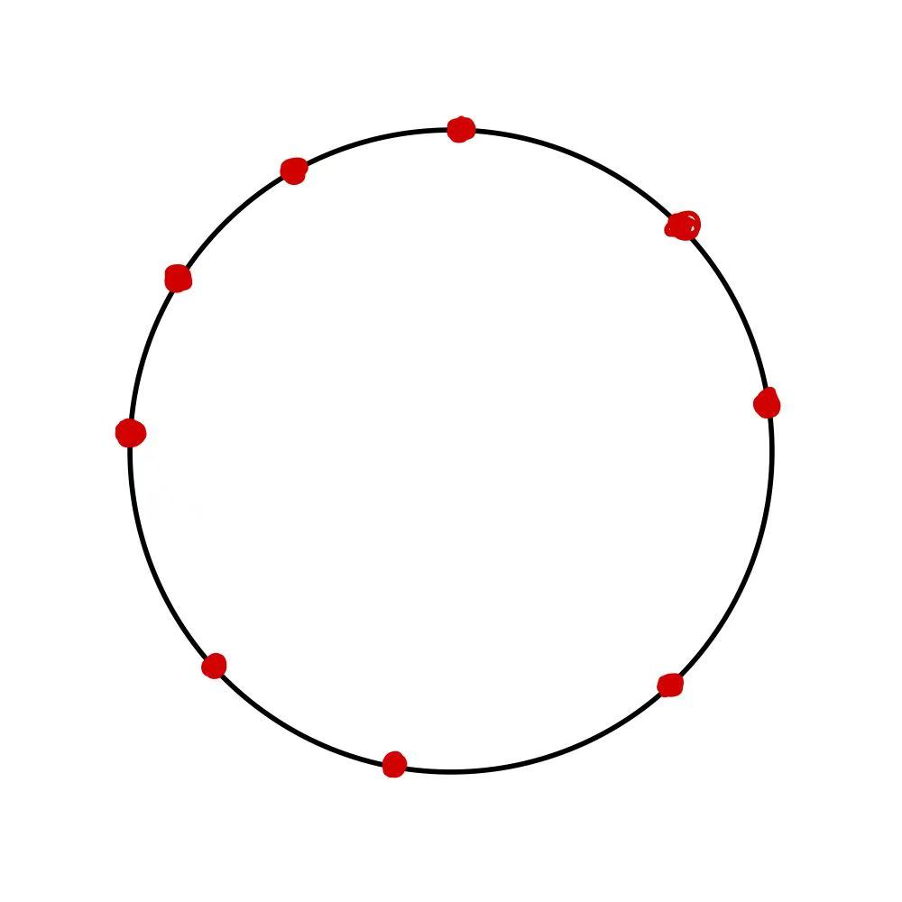
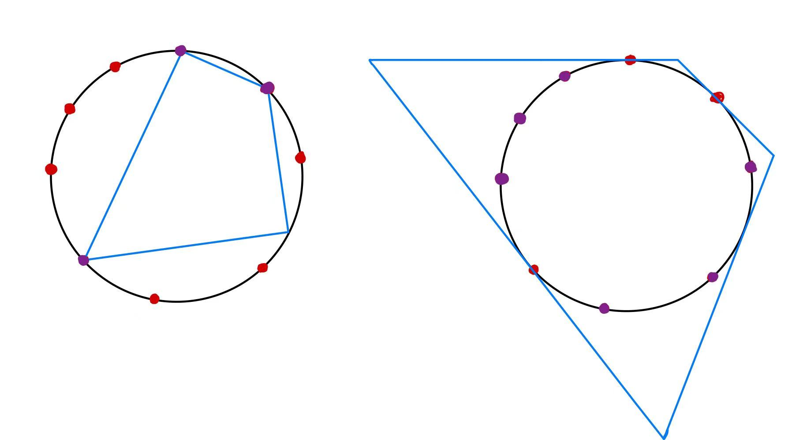
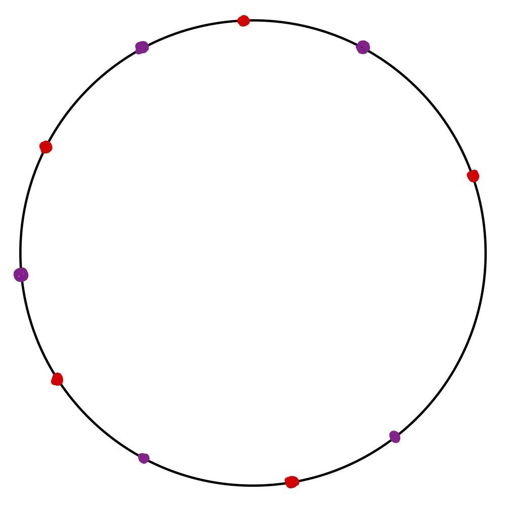
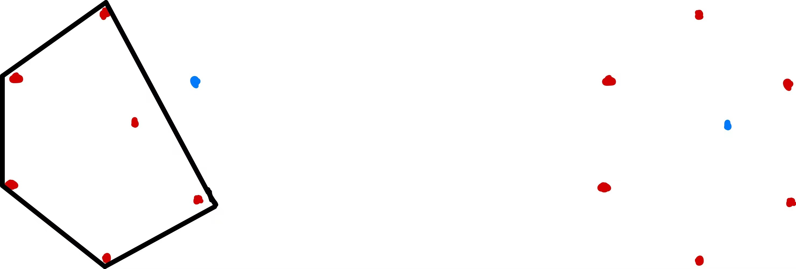

# 作业 2：学习理论

## 2 概率近似正确（Probably Approximately Correct）（35pt）

##### 1. 证明如果误差 $\mathcal{E}\left(\mathrm{R}_{\mathcal{D}_n}\right)$ 大于 $\epsilon$ ，那么 $\mathrm{R}_{\mathcal{D}_n}$ 必然和某个 $r_i$ 不重叠，即 $\displaystyle\left\{\mathcal{E}\left(\mathrm{R}_{\mathcal{D}_n}\right)>\epsilon\right\}\subset\bigcup_{i=1}^{4}\left\{\mathrm{R}_{\mathcal{D}_n}\cap r_i=\emptyset\right\}$ 。

假设误差 $\mathcal{E}\left(\mathrm{R}_{\mathcal{D}_n}\right)>\epsilon$ 而 $\mathrm{R}_{\mathcal{D}_n}$ 和所有 $r_i$ 都有重叠。

此时，记矩形

$$
\mathrm{R}_{\mathcal{D}_n}=[l',r']\times[b',t']
$$

$$
r_1=[l,r]\times[b'',t]
$$

$$
r_2=[l'',r]\times[b,t]
$$

$$
r_3=[l,r]\times[b,t'']
$$

$$
r_4=[l,r'']\times[b,t]
$$

则显然有 $l\le l'\le l''\le r''\le r'\le r$ ， $b\le b'\le b''\le t''\le t'\le t$ 。

记 $r_1,r_2,r_3,r_4$ 组成的图形为 $\mathrm{R}''$ ，由于 $r_i$ 是概率 $\Pr\left[r_i\right]\ge\frac{\epsilon}{4}$ 的最小矩形，同时考虑到四个矩形存在重叠部分，可以得出 $\Pr\left[\mathrm{R}''\right]<\epsilon$ 。

由于 $l\le l'\le l''\le r''\le r'\le r$ ， $b\le b'\le b''\le t''\le t'\le t$ ，所以有 $\mathcal{E}\left(\mathrm{R}_{\mathcal{D}_n}\right)<\Pr\left[\mathrm{R}''\right]<\epsilon$ ，与题设矛盾。故 $\mathrm{R}_{\mathcal{D}_n}$ 必然和某个 $r_i$ 不重叠。

##### 2. 计算矩形 $\mathrm{R}_{\mathcal{D}_n}$ 和给定区域 $r_i$ 没有任何重叠的概率 $\displaystyle\Pr_{\mathcal{D}_n\sim D^n}\left[\left\{\mathrm{R}_{\mathcal{D}_n}\cap r_i=\emptyset\right\}\right]$ 尽可能紧的上界。

要使矩形 $\mathrm{R}_{\mathcal{D}_n}$ 和给定区域 $r_i$ 没有任何重叠，需要保证训练集 $\mathcal{D}_n$ 中的所有正例点都不在 $r_i$ 中，另外，训练集 $\mathcal{D}_n$ 中的所有负例点必然不在 $\mathrm{R}$ 中，自然不会在 $r_i$ 中。故需要保证训练集 $\mathcal{D}_n$ 中的所有 $n$ 个点都不在 $r_i$ 中，即

$$
\Pr_{\mathcal{D}_n\sim D^n}\left[\left\{\mathrm{R}_{\mathcal{D}_n}\cap r_i=\emptyset\right\}\right]=\left(1-\Pr\left[r_i\right]\right)^n\le\left(1-\frac{\epsilon}{4}\right)^n
$$

##### 3. 计算矩形 $\mathrm{R}_{\mathcal{D}_n}$ 和 $r_1$ ， $r_2$ ， $r_3$ 和 $r_4$ 中的某一个没有重叠区域的概率 $\displaystyle\Pr_{\mathcal{D}_n\sim D^n}\left[\bigcup_{i=1}^{4}\left\{\mathrm{R}_{\mathcal{D}_n}\cap r_i=\emptyset\right\}\right]$ 尽可能紧的上界。

利用 Union bound 可得

$$
\Pr_{\mathcal{D}_n\sim D^n}\left[\bigcup_{i=1}^{4}\left\{\mathrm{R}_{\mathcal{D}_n}\cap r_i=\emptyset\right\}\right]\le\sum_{i=1}^{4}\Pr_{\mathcal{D}_n\sim D^n}\left[\left\{\mathrm{R}_{\mathcal{D}_n}\cap r_i=\emptyset\right\}\right]\le4\left(1-\frac{\epsilon}{4}\right)^n
$$

##### 4. 证明： $\displaystyle\Pr_{\mathcal{D}_n\sim D^n}\left[\mathcal{E}\left(\mathrm{R}_{\mathcal{D}_n}\right)>\epsilon\right]\le4\exp\left(-\frac{n\epsilon}{4}\right)$ 。

利用 2.1 题的结论可得

$$
\left\{\mathcal{E}\left(\mathrm{R}_{\mathcal{D}_n}\right)>\epsilon\right\}\subset\bigcup_{i=1}^{4}\left\{\mathrm{R}_{\mathcal{D}_n}\cap r_i=\emptyset\right\}
$$

又因为对于任意 $x\in\mathbb{R}$ ， $1-x\le e^{-x}$ 成立，故

$$
\Pr_{\mathcal{D}_n\sim D^n}\left[\mathcal{E}\left(\mathrm{R}_{\mathcal{D}_n}\right)>\epsilon\right]\le\Pr_{\mathcal{D}_n\sim D^n}\left[\bigcup_{i=1}^{4}\left\{\mathrm{R}_{\mathcal{D}_n}\cap r_i=\emptyset\right\}\right]\le4\left(1-\frac{\epsilon}{4}\right)^n\le4\exp\left(-\frac{n\epsilon}{4}\right)
$$

##### 5. 证明： $\mathbf{R}^2$ 上所有轴对齐矩阵组成的假设空间 $\mathcal{H}$ 是 PAC-可学习的。

PAC-可学习要求对于任意 $\epsilon>0$ ， $\delta>0$ ，有

$$
\Pr_{\mathcal{D}_n\sim D^n}\left[\mathcal{E}\left(\mathrm{R}_{\mathcal{D}_n}\right)-\min_{h\in\mathcal{H}}\mathcal{E}\left(\mathrm{R}\right)>\epsilon\right]\le\delta
$$

由于 $\displaystyle\min_{h\in\mathcal{H}}\mathcal{E}\left(\mathrm{R}\right)=0$ ，令 $\displaystyle\delta=4\exp\left(-\frac{n\epsilon}{4}\right)$ ，利用 2.4 题的结论可得

$$
\Pr_{\mathcal{D}_n\sim D^n}\left[\mathcal{E}\left(\mathrm{R}_{\mathcal{D}_n}\right)>\epsilon\right]\le4\exp\left(-\frac{n\epsilon}{4}\right)
$$

故 $\mathcal{H}$ 是 PAC-可学习的。

##### 6. 计算此时矩形 $\mathrm{R}_{\mathcal{D}_n}$ 和给定区域 $r_i$ 没有任何重叠的概率 $\displaystyle\Pr_{\mathcal{D}_n\sim D^n}\left[\left\{\mathrm{R}_{\mathcal{D}_n}\cap r_i=\emptyset\right\}\right]$ 尽可能紧的上界。

参考 2.2 题的证明，要使矩形 $\mathrm{R}_{\mathcal{D}_n}$ 和给定区域 $r_i$ 没有任何重叠，需要保证训练集 $\mathcal{D}_n$ 中的所有正例点都不在 $r_i$ 中，另外，训练集 $\mathcal{D}_n$ 中的所有负例点必然不在 $\mathrm{R}$ 中，自然不会在 $r_i$ 中。故只有那些噪声的正例点可以在 $r_i$ 中，这些点最多有 $\eta'n$ 个。故需要保证训练集 $\mathcal{D}_n$ 中至少有 $\left(1-\eta'\right)n$ 个点不在 $r_i$ 中，即

$$
\Pr_{\mathcal{D}_n\sim D^n}\left[\left\{\mathrm{R}_{\mathcal{D}_n}\cap r_i=\emptyset\right\}\right]\le\left(1-\Pr\left[r_i\right]\right)^{\left(1-\eta'\right)n}\le\left(1-\frac{\epsilon}{4}\right)^{\left(1-\eta'\right)n}
$$

##### 7. 给出当存在噪音时， $\displaystyle\Pr_{\mathcal{D}_n\sim D^n}\left[\mathcal{E}\left(\mathrm{R}_{\mathcal{D}_n}\right)>\epsilon\right]$ 的上界，并证明此时 $\mathcal{H}$ 依然是 PAC-可学习的。

参考 2.3-2.5 题的证明，利用 Union bound 可得

$$
\Pr_{\mathcal{D}_n\sim D^n}\left[\bigcup_{i=1}^{4}\left\{\mathrm{R}_{\mathcal{D}_n}\cap r_i=\emptyset\right\}\right]\le\sum_{i=1}^{4}\Pr_{\mathcal{D}_n\sim D^n}\left[\left\{\mathrm{R}_{\mathcal{D}_n}\cap r_i=\emptyset\right\}\right]\le4\left(1-\frac{\epsilon}{4}\right)^{\left(1-\eta'\right)n}
$$

利用 2.1 题的结论可得

$$
\left\{\mathcal{E}\left(\mathrm{R}_{\mathcal{D}_n}\right)>\epsilon\right\}\subset\bigcup_{i=1}^{4}\left\{\mathrm{R}_{\mathcal{D}_n}\cap r_i=\emptyset\right\}
$$

又因为对于任意 $x\in\mathbb{R}$ ， $1-x\le e^{-x}$ 成立，故

$$
\Pr_{\mathcal{D}_n\sim D^n}\left[\mathcal{E}\left(\mathrm{R}_{\mathcal{D}_n}\right)>\epsilon\right]\le\Pr_{\mathcal{D}_n\sim D^n}\left[\bigcup_{i=1}^{4}\left\{\mathrm{R}_{\mathcal{D}_n}\cap r_i=\emptyset\right\}\right]\le4\left(1-\frac{\epsilon}{4}\right)^{\left(1-\eta'\right)n}\le4\exp\left(-\frac{\left(1-\eta'\right)n\epsilon}{4}\right)
$$

PAC-可学习要求对于任意 $\epsilon>0$ ， $\delta>0$ ，有

$$
\Pr_{\mathcal{D}_n\sim D^n}\left[\mathcal{E}\left(\mathrm{R}_{\mathcal{D}_n}\right)-\min_{h\in\mathcal{H}}\mathcal{E}\left(\mathrm{R}\right)>\epsilon\right]\le\delta
$$

由于 $\displaystyle\min_{h\in\mathcal{H}}\mathcal{E}\left(\mathrm{R}\right)=0$ ，令 $\displaystyle\delta=4\exp\left(-\frac{\left(1-\eta'\right)n\epsilon}{4}\right)$ ，利用 2.4 题的结论可得

$$
\Pr_{\mathcal{D}_n\sim D^n}\left[\mathcal{E}\left(\mathrm{R}_{\mathcal{D}_n}\right)>\epsilon\right]\le4\exp\left(-\frac{\left(1-\eta'\right)n\epsilon}{4}\right)
$$

故 $\mathcal{H}$ 是 PAC-可学习的。

## 3 集中不等式（10pt）

##### 取值在 $\left\{1,2,\dots,K\right\}$ 的 $X_1,X_2,\dots,X_n$ 是服从 Multinoulli 分布的独立随机变量， $\Pr\left[X_i=k\right]=p_k$ ，参数 $\boldsymbol{p}=\left(p_1,\dots,p_K\right)$ 满足 $p_k\ge0$ ， $\displaystyle\sum p_k=1$。我们可以使用经验分布 $\hat{\boldsymbol{p}}=\left(\hat{p}_1,\dots,\hat{p}_K\right)$ ： $\displaystyle\hat{p}_k=\frac{1}{m}\sum_{i=1}^{m}\mathbb{I}\left[X_i=k\right],\ k=1,2,\dots,K$ 来估计 $\boldsymbol{p}$。求证：对任意 $\delta>0$，以至少 $1−\delta$ 的概率， $\displaystyle\left\lVert\boldsymbol{p}-\hat{\boldsymbol{p}}\right\rVert_{\infty}=\max_{k}\left\lvert p_k-\hat{p}_k\right\rvert\le\sqrt{\frac{1}{2n}\log\frac{2K}{\delta}}$ 。

利用 Hoeffding 不等式可得，对于 $a_i<X_i<b_i$ ，有

$$
\Pr\left(\left\lvert\sum_{i=1}^{n}\left(X_i-\mathbb{E}X_i\right)\right\rvert\ge\epsilon\right)\le2\exp\left[-\frac{2\epsilon^2}{\sum_{i=1}^{n}\left(b_i-a_i\right)^2}\right]
$$

代入此题中的条件：

$$
a_i=0\le\mathbb{I}\left[X_i=k\right]\le1=b_i
$$

$$
\sum_{i=1}^{n}\left(\mathbb{I}\left[X_i=k\right]-\mathbb{E}\left[\mathbb{I}\left[X_i=k\right]\right]\right)=\sum_{i=1}^{n}\mathbb{I}\left[X_i=k\right]-\sum_{i=1}^{n}\mathbb{E}\left[\mathbb{I}\left[X_i=k\right]\right]=n\hat{p}_k-np_k
$$

故可得

$$
\Pr\left(\left\lvert\hat{p}_k-p_k\right\rvert\ge\epsilon\right)=\Pr\left(\left\lvert n\hat{p}_k-np_k\right\rvert\ge n\epsilon\right)\le2\exp\left[-\frac{2n^2\epsilon^2}{n}\right]=2\exp\left[-2n\epsilon^2\right]
$$

由于

$$
\Pr\left(\max_{k}\left\lvert\hat{p}_k-p_k\right\rvert\ge\epsilon\right)\le\sum_{k=1}^{K}\Pr\left(\left\lvert\hat{p}_k-p_k\right\rvert\ge\epsilon\right)=2K\exp\left[-2n\epsilon^2\right]
$$

令

$$
2K\exp\left[-2n\epsilon^2\right]=\delta
$$

求解得到

$$
\epsilon=\sqrt{\frac{1}{2n}\log\frac{2K}{\delta}}
$$

故

$$
\Pr\left(\max_{k}\left\lvert\hat{p}_k-p_k\right\rvert\ge\sqrt{\frac{1}{2n}\log\frac{2K}{\delta}}\right)\le\delta
$$

即对任意 $\delta>0$，以至少 $1−\delta$ 的概率， $\displaystyle\left\lVert\boldsymbol{p}-\hat{\boldsymbol{p}}\right\rVert_{\infty}=\max_{k}\left\lvert p_k-\hat{p}_k\right\rvert\le\sqrt{\frac{1}{2n}\log\frac{2K}{\delta}}$ 。

## 4 有限假设空间的泛化界（15pt）

##### 假设 $D$ 是定义在 $\mathcal{X}$ 上的一个数据分布， $f:\mathcal{X}→\left\{+1,−1\right\}$ 是打标函数（labeling function）。定义分布 $D$ 上的标签偏置 $p_{+}$ 为： $\displaystyle p_{+}=\Pr_{x\sim D}\left[f(x)=+1\right]$ 。定义 $S$ 是从分布 $D$ 独立同分布采样出的一个大小为 $n$ 的数据集。我们可以使用 $\displaystyle\hat{p}_{+}=\frac{1}{n}\sum_{x\in S}\mathbb{I}\left[f(x)=+1\right]$ 。求证：对于任意 $\delta>0$， $\displaystyle\left\lvert p_{+}-\hat{p}_{+}\right\rvert\le\sqrt{\frac{\log\frac{2}{\delta}}{2n}}$ 成立的概率至少为 $1−\delta$ 。

利用 Hoeffding 不等式可得，对于 $a_i<X_i<b_i$ ，有

$$
\Pr\left(\left\lvert\sum_{i=1}^{n}\left(X_i-\mathbb{E}X_i\right)\right\rvert\ge\epsilon\right)\le2\exp\left[-\frac{2\epsilon^2}{\sum_{i=1}^{n}\left(b_i-a_i\right)^2}\right]
$$

代入此题中的条件：

$$
a_i=0\le\mathbb{I}\left[f(x)=+1\right]\le1=b_i
$$

$$
\sum_{i=1}^{n}\left(\mathbb{I}\left[f(x)=+1\right]-\mathbb{E}\left[\mathbb{I}\left[f(x)=+1\right]\right]\right)=\sum_{i=1}^{n}\mathbb{I}\left[f(x)=+1\right]-\sum_{i=1}^{n}\mathbb{E}\left[\mathbb{I}\left[f(x)=+1\right]\right]=n\hat{p}_{+}-np_{+}
$$

故可得

$$
\Pr\left(\left\lvert\hat{p}_{+}-p_{+}\right\rvert\ge\epsilon\right)=\Pr\left(\left\lvert n\hat{p}_{+}-np_{+}\right\rvert\ge n\epsilon\right)\le2\exp\left[-\frac{2n^2\epsilon^2}{n}\right]=2\exp\left[-2n\epsilon^2\right]
$$

令

$$
2\exp\left[-2n\epsilon^2\right]=\delta
$$

求解得到

$$
\epsilon=\sqrt{\frac{\log\frac{2}{\delta}}{2n}}
$$

故

$$
\Pr\left(\left\lvert\hat{p}_{+}-p_{+}\right\rvert\ge\sqrt{\frac{\log\frac{2}{\delta}}{2n}}\right)\le\delta
$$

即对于任意 $\delta>0$， $\displaystyle\left\lvert p_{+}-\hat{p}_{+}\right\rvert\le\sqrt{\frac{\log\frac{2}{\delta}}{2n}}$ 成立的概率至少为 $1−\delta$ 。

## 5 无限假设空间的泛化界（50pt）

### 5.1 Rademacher 复杂度

##### 1. 定义只包含两个函数的函数族 $\mathcal{G}=\left\{g_{−1},g_{+1}\right\}$ ，其中 $g_{−1}$ 是恒取 $−1$ 的常数函数， $g_{+1}$ 是恒取 $+1$ 的常数函数， $S=\left(z_1,z_2,\dots,z_m\right)$ 是从分布 $\mathcal{D}$ 采样的大小为 $m$ 的数据集。请直接给出 $\mathcal{G}$ 的 VC 维，并推导 Rademacher 经验复杂度 $\hat{\mathcal{R}}_S\left(\mathcal{G}\right)$ 的上界。

$\mathcal{G}$ 的 VC 维为 1 。

Rademacher 经验复杂度定义为 $\displaystyle\hat{\mathcal{R}}_S(\mathcal{G})=\mathbb{E}_{\boldsymbol{\sigma}}\left[\sup_{g\in\mathcal{G}}\frac{1}{m}\sum_{i=1}^{m}\sigma_ig(\boldsymbol{z}_i)\right]$ 。

分别计算 $g_{-1}$ 和 $g_{+1}$ 的对应值：

$$
\frac{1}{m}\sum_{i=1}^{m}\sigma_ig_{-1}(\boldsymbol{z}_i)=-\frac{1}{m}\sum_{i=1}^{m}\sigma_i
$$

$$
\frac{1}{m}\sum_{i=1}^{m}\sigma_ig_{+1}(\boldsymbol{z}_i)=\frac{1}{m}\sum_{i=1}^{m}\sigma_i
$$

故

$$
\hat{\mathcal{R}}_S(\mathcal{G})=\mathbb{E}\left[\sup_{g\in\mathcal{G}}\frac{1}{m}\sum_{i=1}^{m}\sigma_ig(\boldsymbol{z}_i)\right]=\mathbb{E}\left[\left\lvert\frac{1}{m}\sum_{i=1}^{m}\sigma_i\right\rvert\right]
$$

根据 Jensen 不等式，对于一个凸函数 $f$ ，有 $f\left(\mathbb{E}\left[X\right]\right)\le\mathbb{E}\left[f\left(X\right)\right]$ ，反之，对于一个凹函数 $f$ ，有 $f\left(\mathbb{E}\left[X\right]\right)\ge\mathbb{E}\left[f\left(X\right)\right]$ 。

在这种情况下，绝对值的期望可以用 Jensen 不等式进行上界估计，因为绝对值是一个凹函数。因此我们可以得到：

$$
\mathbb{E}\left[\left\lvert\frac{1}{m}\sum_{i=1}^{m}\sigma_i\right\rvert\right]\le\sqrt{\mathbb{E}\left[\left(\frac{1}{m}\sum_{i=1}^{m}\sigma_i\right)^2\right]}\le\sqrt{\frac{1}{m^2}\sum_{i=1}^{m}\mathbb{E}\left[\sigma_i^2\right]}=\sqrt{\frac{1}{m^2}\cdot m}=\frac{1}{\sqrt{m}}
$$

即 $\displaystyle\hat{\mathcal{R}}_S(\mathcal{G})\le\frac{1}{\sqrt{m}}$ 。

##### 2. 定义函数族 $\mathcal{G}:\mathcal{Z}\to\left[0,1\right]$ ，课件中对于 Rademacher 复杂度的上界推导是基于对函数 $\displaystyle\Phi(S)=\sup_{g∈G}\left(\mathbb{E}_{\mathcal{D}}\left[g\right]−\hat{\mathbb{E}}_{S}\left[g\right]\right)$ 的分析，其中 $S=(z_1,z_2,\dots,z_m)$ 是从分布 $\mathcal{D}$ 采样的大小为 $m$ 的数据集，$\displaystyle\hat{\mathbb{E}}_{S}\left[g\right]=\frac{1}{m}\sum_{i=1}^{m}g\left(z_i\right)$。在本题中你将再次使用 McDiarmid 不等式，基于对函数 $\displaystyle\Psi\left(S\right)=\sup_{g\in\mathcal{G}}\left(\mathbb{E}_{\mathcal{D}}\left[g\right]−\hat{\mathbb{E}}_{S}\left[g\right]−2\hat{\mathcal{R}}_{S}\left(\mathcal{G}\right)\right)$ 的分析，推导出 Rademacher 复杂度更紧的上界。要求给出完整证明，以及使用概率近似正确框架表述最终的结论。

首先检查函数 $\displaystyle\Psi\left(S\right)=\sup_{g\in\mathcal{G}}\left(\mathbb{E}_{\mathcal{D}}\left[g\right]−\hat{\mathbb{E}}_{S}\left[g\right]−2\hat{\mathcal{R}}_{S}\left(\mathcal{G}\right)\right)$ 是否满足 McDiarmid 不等式的条件。

$$
\begin{align*}
\Psi\left(S\right)-\Psi\left(S'\right)&=\sup_{g\in\mathcal{G}}\left(\mathbb{E}_{\mathcal{D}}\left[g\right]−\hat{\mathbb{E}}_{S}\left[g\right]−2\hat{\mathcal{R}}_{S}\left(\mathcal{G}\right)\right)-\sup_{g\in\mathcal{G}}\left(\mathbb{E}_{\mathcal{D}}\left[g\right]−\hat{\mathbb{E}}_{S'}\left[g\right]−2\hat{\mathcal{R}}_{S'}\left(\mathcal{G}\right)\right)\\
&\le\sup_{g\in\mathcal{G}}\left\{\left(\mathbb{E}_{\mathcal{D}}\left[g\right]−\hat{\mathbb{E}}_{S}\left[g\right]−2\hat{\mathcal{R}}_{S}\left(\mathcal{G}\right)\right)-\left(\mathbb{E}_{\mathcal{D}}\left[g\right]−\hat{\mathbb{E}}_{S'}\left[g\right]−2\hat{\mathcal{R}}_{S'}\left(\mathcal{G}\right)\right)\right\}\\
&=\sup_{g\in\mathcal{G}}\left\{\hat{\mathbb{E}}_{S'}\left[g\right]-\hat{\mathbb{E}}_{S}\left[g\right]+2\left(\hat{\mathcal{R}}_{S'}\left(\mathcal{G}\right)-\hat{\mathcal{R}}_{S}\left(\mathcal{G}\right)\right)\right\}\\
&\le\sup_{g\in\mathcal{G}}\left(\hat{\mathbb{E}}_{S'}\left[g\right]−\hat{\mathbb{E}}_{S}\left[g\right]\right)+2\sup_{g\in\mathcal{G}}\left(\hat{\mathcal{R}}_{S'}\left(\mathcal{G}\right)-\hat{\mathcal{R}}_{S}\left(\mathcal{G}\right)\right)\\
&\le\frac{3}{m}
\end{align*}
$$

最后一步利用了课件上的结论 $\displaystyle\sup_{g\in\mathcal{G}}\left(\hat{\mathbb{E}}_{S'}\left[g\right]−\hat{\mathbb{E}}_{S}\left[g\right]\right)\le\frac{1}{m}$ 和 $\displaystyle\left\lvert\hat{\mathcal{R}}_{S'}\left(\mathcal{G}\right)-\hat{\mathcal{R}}_{S}\left(\mathcal{G}\right)\right\rvert\le\frac{1}{m}$ 。

利用 McDiarmid 不等式可得

$$
\Pr\left(\Psi\left(S\right)-\mathbb{E}_{S}\left[\Psi\left(S\right)\right]\ge\epsilon\right)\le\exp\left(-\frac{2\epsilon^2}{\sum_{i=1}^{m}\left(\frac{3}{m}\right)^2}\right)=\exp\left(-\frac{2m\epsilon^2}{9}\right)
$$

故至少有 $\displaystyle1-\frac{\delta}{2}$ 的概率有

$$
\Psi\left(S\right)\le\mathbb{E}_{S}\left[\Psi\left(S\right)\right]+3\sqrt{\frac{\log\frac{2}{\delta}}{2m}}
$$

而

$$
\begin{align*}
\mathbb{E}_{S}\left[\Psi\left(S\right)\right]&=\mathbb{E}_{S}\left[\sup_{g\in\mathcal{G}}\left(\mathbb{E}_{\mathcal{D}}\left[g\right]−\hat{\mathbb{E}}_{S}\left[g\right]−2\hat{\mathcal{R}}_{S}\left(\mathcal{G}\right)\right)\right]\\
&=\mathbb{E}_{S}\left[\sup_{g\in\mathcal{G}}\mathbb{E}_{S'}\left(\hat{\mathbb{E}}_{S'}\left[g\right]-\hat{\mathbb{E}}_{S}\left[g\right]−2\hat{\mathcal{R}}_{S}\left(\mathcal{G}\right)\right)\right]\\
&\le\mathbb{E}_{S,S'}\left[\sup_{g\in\mathcal{G}}\left(\hat{\mathbb{E}}_{S'}\left[g\right]-\hat{\mathbb{E}}_{S}\left[g\right]\right)-2\hat{\mathcal{R}}_{S}\left(\mathcal{G}\right)\right]\\
&\le\mathbb{E}_{S,S'}\left[\sup_{g\in\mathcal{G}}\left(\hat{\mathbb{E}}_{S'}\left[g\right]-\hat{\mathbb{E}}_{S}\left[g\right]\right)\right]\\
&\le2\mathcal{R}_{S}\left(\mathcal{G}\right)
\end{align*}
$$

最后一步利用了课件上的结论 $\displaystyle\mathbb{E}_{S,S'}\left[\sup_{g\in\mathcal{G}}\left(\hat{\mathbb{E}}_{S'}\left[g\right]-\hat{\mathbb{E}}_{S}\left[g\right]\right)\right]\le2\mathcal{R}_{S}\left(\mathcal{G}\right)$ 。

又因为利用 McDiarmid 不等式可得至少有 $\displaystyle1-\frac{\delta}{2}$ 的概率有

$$
\mathcal{R}_{S}\left(\mathcal{G}\right)\le\hat{\mathcal{R}}_{S}\left(\mathcal{G}\right)+\sqrt{\frac{\log\frac{2}{\delta}}{2m}}
$$

故至少有 $\displaystyle1-\frac{\delta}{2}$ 的概率有

$$
\Psi\left(S\right)\le2\mathcal{R}_{S}\left(\mathcal{G}\right)+3\sqrt{\frac{\log\frac{2}{\delta}}{2m}}\le2\hat{\mathcal{R}}_{S}\left(\mathcal{G}\right)+5\sqrt{\frac{\log\frac{2}{\delta}}{2m}}
$$

即至少有 $1-\delta$ 的概率有

$$
\mathbb{E}_{z\sim D}\left[g(z)\right]\le\frac{1}{n}\sum_{i=1}^{m}g(z_i)+2\mathcal{R}_{S}\left(\mathcal{G}\right)+3\sqrt{\frac{\log\frac{2}{\delta}}{2m}}
$$

$$
\mathbb{E}_{z\sim D}\left[g(z)\right]\le\frac{1}{n}\sum_{i=1}^{m}g(z_i)+2\hat{\mathcal{R}}_{S}\left(\mathcal{G}\right)+5\sqrt{\frac{\log\frac{2}{\delta}}{2m}}
$$

### 5.2 增长函数

##### 定义从 $\mathbf{R}$ 映射到 $\left\{+1,−1\right\}$ 的阈值函数族 $\mathcal{H}=\left\{x\to\mathbb{I}\left[x\ge\theta\right]\middle\vert\theta\in\mathbf{R}\right\}\cup\left\{x\to\mathbb{I}\left[x\le\theta\right]\middle\vert\theta\in\mathbf{R}\right\}$ ，请求出函数族 $\mathcal{H}$ 的增长函数，并导出 $\mathcal{R}_n\left(\mathcal{H}\right)$ 的上界。

利用增长函数的定义可知增长函数 $\Pi_{\mathcal{H}}\left(n\right)$ 是指对任意 $n$ 个样本点 $x_1,x_2,\dots,x_n$ ，阈值函数族 $\mathcal{H}$ 在这些点上的分类情况的总数。

而对于阈值函数族 $\mathcal{H}=\left\{x\to\mathbb{I}\left[x\ge\theta\right]\middle\vert\theta\in\mathbf{R}\right\}\cup\left\{x\to\mathbb{I}\left[x\le\theta\right]\middle\vert\theta\in\mathbf{R}\right\}$ ，有两种主要的划分方式：

- 将满足 $x\ge\theta$ 的点标记为 $+1$ ，满足 $x\le\theta$ 的点标记为 $-1$ ，此时有 $n+1$ 种划分方式；
- 将满足 $x\ge\theta$ 的点标记为 $-1$ ，满足 $x\le\theta$ 的点标记为 $+1$ ，此时有 $n+1$ 种划分方式。

故 $\Pi_{\mathcal{H}}\left(n\right)=2n+2$ 。

利用课件上的结论可得 $\displaystyle\mathcal{R}_n\left(\mathcal{H}\right)\le\sqrt{\frac{2\log\Pi_{\mathcal{H}}\left(n\right)}{n}}$ ，代入 $\Pi_{\mathcal{H}}\left(n\right)=2n+2$ 可得

$$
\mathcal{R}_n\left(\mathcal{H}\right)\le\sqrt{\frac{2\log\left(2n+2\right)}{n}}
$$

### 5.3 VC 维

##### 与第 [2](#2-概率近似正确probably-approximately-correct35pt) 题中的轴对齐矩阵学习问题类似，我们考虑凸 $d$ 边形学习问题。设假设空间 $\mathcal{H}=\left\{\mathbb{I}\left[x\in P\right]|P\text{ is a convex d-gon}\right\}$ 是二维平面 $\mathbf{R}^2$ 上所有凸 $d$ 边形分类函数的集合。证明： $\mathcal{H}$ 的 VC 维是 $2d+1$ 。（不考虑数据中存在三点共线的情况）

要证明下界，我们可以构造一个所有 $2d+1$ 个点排布在一个凸 $2d+1$ 边形上（这里画成排布在一个圆上，事实上是等价的）的情况。对于正例数量 $\le d$ 的情况，可以构造一个顶点包括了全部正例的圆内接凸 $d$ 边形，将其区分开来。对于正例数量 $>d$ 的情况，可以构造一个边与圆切于负例的圆外切凸 $d$ 边形，将其区分开来。如图。

|    点的排布     |     点的划分      |
| :-------------: | :---------------: |
|  |  |

故 $\mathcal{H}$ 的 VC 维至少为 $2d+1$ 。

下面证明上界。

对于任意 $2d+2$ 个点，假设这些点排布在一个凸 $2d+2$ 边形上，对于正例和负例交替排布的情况，显然需要至少 $d+1$ 条边才能将其区分开来。故此时凸 $d$ 边形无法打散这些点。

假设这些点不排布在一个凸 $2d+2$ 边形上，则至少有一个点位于其他点的“内部”。当这个点为负例而包围它的至少 $d+1$ 个点为正例时，显然无法用凸 $d$ 边形将其区分开来。故此时凸 $d$ 边形无法打散这些点。

| 点排布在一个凸 $2d+2$ 边形上 | 点不排布在一个凸 $2d+2$ 边形上 |
| :--------------------------: | :----------------------------: |
|             |               |

故 $\mathcal{H}$ 的 VC 维至多为 $2d+1$ 。

综上，$\mathcal{H}$ 的 VC 维是 $2d+1$ 。

---

成绩：97

评语：2.5 -1; 2.6 -5; 2.7 -1; 5.1.2 -3; 5.2 -3
