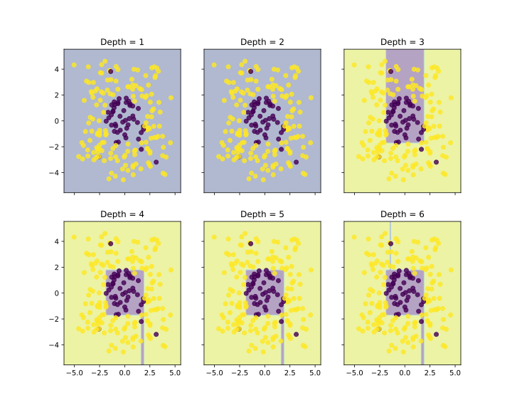
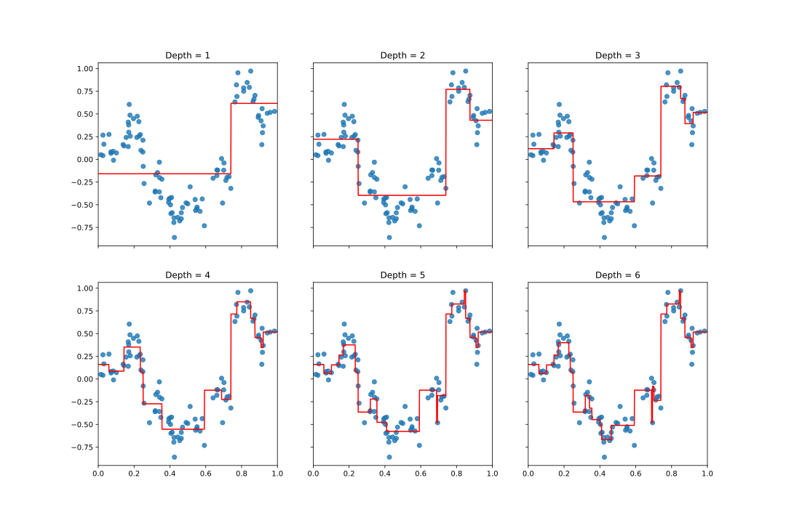
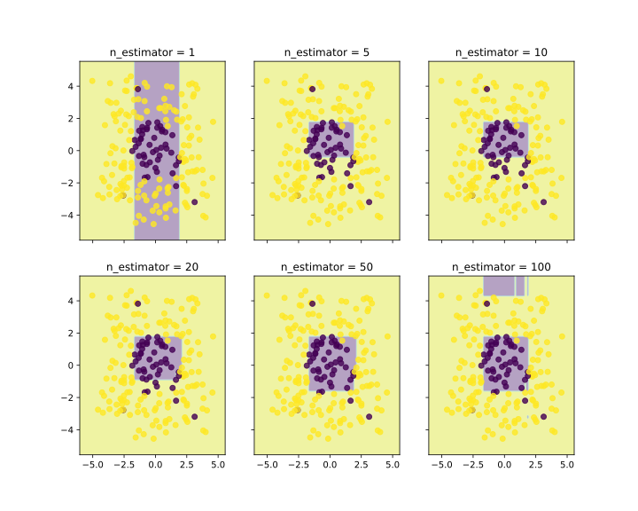
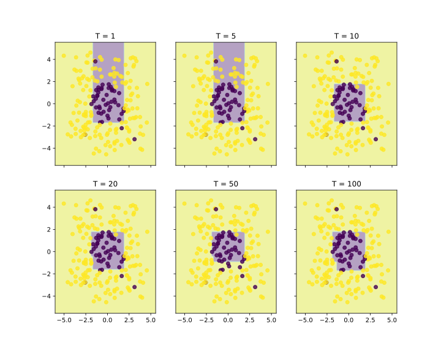
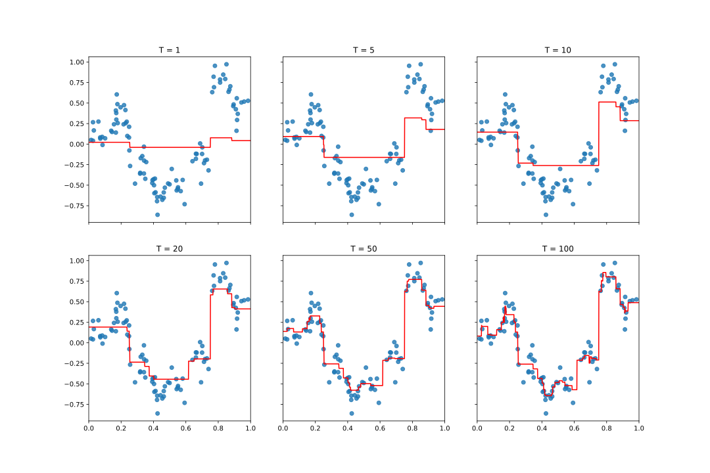

# 作业 3：决策树与提升算法

## 2 决策树（40pt）

### 2.1 ID3 决策树算法（15pt）

##### 1. 虽然表中没有列出数据集中的具体实例，但已经足以构建一棵 ID3 决策树的根节点（决策树桩）。请通过计算说明应该如何构建。

计算按是否晴天分类的信息增益

$$
\begin{align*}
H\left(\mathcal{D}\right)&=-\frac{35}{50}\log\frac{35}{50}-\frac{15}{50}\log\frac{15}{50}&\approx0.8813\\
H\left(\mathcal{D}_{1}\right)&=-\frac{28}{34}\log\frac{28}{34}-\frac{6}{34}\log\frac{6}{34}&\approx0.6723\\
H\left(\mathcal{D}_{2}\right)&=-\frac{7}{16}\log\frac{7}{16}-\frac{9}{16}\log\frac{9}{16}&\approx0.9887
\end{align*}
$$

$$
H\left(\mathcal{D}\right)-\frac{\left\lvert\mathcal{D}_{1}\right\rvert}{\left\lvert\mathcal{D}\right\rvert}H\left(\mathcal{D}_{1}\right)-\frac{\left\lvert\mathcal{D}_{2}\right\rvert}{\left\lvert\mathcal{D}\right\rvert}H\left(\mathcal{D}_{2}\right)=0.8813-\frac{34}{50}\times0.6723-\frac{16}{50}\times0.9887\approx0.1077
$$

计算按是否有雪分类的信息增益

$$
\begin{align*}
H\left(\mathcal{D}\right)&=-\frac{35}{50}\log\frac{35}{50}-\frac{15}{50}\log\frac{15}{50}&\approx0.8813\\
H\left(\mathcal{D}_{1}\right)&=-\frac{16}{18}\log\frac{16}{18}-\frac{2}{18}\log\frac{2}{18}&\approx0.5033\\
H\left(\mathcal{D}_{2}\right)&=-\frac{19}{32}\log\frac{19}{32}-\frac{13}{32}\log\frac{13}{32}&\approx0.9745\\
\end{align*}
$$

$$
H\left(\mathcal{D}\right)-\frac{\left\lvert\mathcal{D}_{1}\right\rvert}{\left\lvert\mathcal{D}\right\rvert}H\left(\mathcal{D}_{1}\right)-\frac{\left\lvert\mathcal{D}_{2}\right\rvert}{\left\lvert\mathcal{D}\right\rvert}H\left(\mathcal{D}_{2}\right)=0.8813-\frac{18}{50}\times0.5033-\frac{32}{50}\times0.9745\approx0.0764
$$

因此，根节点应该按是否晴天分类。

##### 2. 使用最小错误替换 ID3 算法信息增益公式中的熵函数，构建一棵完整的决策树（展现过程）。

首先构造根节点。

$$
\text{MinError}\left(\mathcal{D}\right)=\min\left\{\frac{11}{24},\frac{13}{24}\right\}=\frac{11}{24}
$$

计算按颜色分类的信息增益

$$
\begin{align*}
\text{MinError}\left(\mathcal{D}_{1}\right)&=\min\left\{\frac{5}{13},\frac{8}{13}\right\}&=\frac{5}{13}\\
\text{MinError}\left(\mathcal{D}_{2}\right)&=\min\left\{\frac{6}{11},\frac{5}{11}\right\}&=\frac{5}{11}
\end{align*}
$$

$$
\text{MinError}\left(\mathcal{D}\right)-\frac{\left\lvert\mathcal{D}_{1}\right\rvert}{\left\lvert\mathcal{D}\right\rvert}\text{MinError}\left(\mathcal{D}_{1}\right)-\frac{\left\lvert\mathcal{D}_{2}\right\rvert}{\left\lvert\mathcal{D}\right\rvert}\text{MinError}\left(\mathcal{D}_{2}\right)=\frac{11}{24}-\frac{13}{24}\times\frac{5}{13}-\frac{11}{24}\times\frac{5}{11}=\frac{1}{24}
$$

计算按大小分类的信息增益

$$
\begin{align*}
\text{MinError}\left(\mathcal{D}_{1}\right)&=\min\left\{\frac{7}{18},\frac{11}{18}\right\}&=\frac{7}{18}\\
\text{MinError}\left(\mathcal{D}_{2}\right)&=\min\left\{\frac{2}{6},\frac{4}{6}\right\}&=\frac{2}{6}
\end{align*}
$$

$$
\text{MinError}\left(\mathcal{D}\right)-\frac{\left\lvert\mathcal{D}_{1}\right\rvert}{\left\lvert\mathcal{D}\right\rvert}\text{MinError}\left(\mathcal{D}_{1}\right)-\frac{\left\lvert\mathcal{D}_{2}\right\rvert}{\left\lvert\mathcal{D}\right\rvert}\text{MinError}\left(\mathcal{D}_{2}\right)=\frac{11}{24}-\frac{18}{24}\times\frac{7}{18}-\frac{6}{24}\times\frac{2}{6}=\frac{1}{12}
$$

计算按动作分类的信息增益

$$
\begin{align*}
\text{MinError}\left(\mathcal{D}_{1}\right)&=\min\left\{\frac{5}{12},\frac{7}{12}\right\}&=\frac{5}{12}\\
\text{MinError}\left(\mathcal{D}_{2}\right)&=\min\left\{\frac{6}{12},\frac{6}{12}\right\}&=\frac{6}{12}
\end{align*}
$$

$$
\text{MinError}\left(\mathcal{D}\right)-\frac{\left\lvert\mathcal{D}_{1}\right\rvert}{\left\lvert\mathcal{D}\right\rvert}\text{MinError}\left(\mathcal{D}_{1}\right)-\frac{\left\lvert\mathcal{D}_{2}\right\rvert}{\left\lvert\mathcal{D}\right\rvert}\text{MinError}\left(\mathcal{D}_{2}\right)=\frac{11}{24}-\frac{12}{24}\times\frac{5}{12}-\frac{12}{24}\times\frac{6}{12}=0
$$

计算按年龄分类的信息增益

$$
\begin{align*}
\text{MinError}\left(\mathcal{D}_{1}\right)&=\min\left\{\frac{6}{12},\frac{6}{12}\right\}&=\frac{6}{12}\\
\text{MinError}\left(\mathcal{D}_{2}\right)&=\min\left\{\frac{5}{12},\frac{7}{12}\right\}&=\frac{5}{12}
\end{align*}
$$

$$
\text{MinError}\left(\mathcal{D}\right)-\frac{\left\lvert\mathcal{D}_{1}\right\rvert}{\left\lvert\mathcal{D}\right\rvert}\text{MinError}\left(\mathcal{D}_{1}\right)-\frac{\left\lvert\mathcal{D}_{2}\right\rvert}{\left\lvert\mathcal{D}\right\rvert}\text{MinError}\left(\mathcal{D}_{2}\right)=\frac{11}{24}-\frac{12}{24}\times\frac{6}{12}-\frac{12}{24}\times\frac{5}{12}=0
$$

因此，根节点应该按大小分类。

对于“小”的那部分，显然可以根据颜色或年龄分类。

对于“大”的那部分

$$
\text{MinError}\left(\mathcal{D}\right)=\min\left\{\frac{7}{18},\frac{11}{18}\right\}=\frac{7}{18}
$$

计算按颜色分类的信息增益

$$
\begin{align*}
\text{MinError}\left(\mathcal{D}_{1}\right)&=\min\left\{\frac{5}{13},\frac{8}{13}\right\}&=\frac{5}{13}\\
\text{MinError}\left(\mathcal{D}_{2}\right)&=\min\left\{\frac{2}{5},\frac{3}{5}\right\}&=\frac{2}{5}
\end{align*}
$$

$$
\text{MinError}\left(\mathcal{D}\right)-\frac{\left\lvert\mathcal{D}_{1}\right\rvert}{\left\lvert\mathcal{D}\right\rvert}\text{MinError}\left(\mathcal{D}_{1}\right)-\frac{\left\lvert\mathcal{D}_{2}\right\rvert}{\left\lvert\mathcal{D}\right\rvert}\text{MinError}\left(\mathcal{D}_{2}\right)=\frac{7}{18}-\frac{13}{18}\times\frac{5}{13}-\frac{5}{18}\times\frac{2}{5}=0
$$

计算按动作分类的信息增益

$$
\begin{align*}
\text{MinError}\left(\mathcal{D}_{1}\right)&=\min\left\{\frac{5}{12},\frac{7}{12}\right\}&=\frac{5}{12}\\
\text{MinError}\left(\mathcal{D}_{2}\right)&=\min\left\{\frac{2}{6},\frac{4}{6}\right\}&=\frac{2}{6}
\end{align*}
$$

$$
\text{MinError}\left(\mathcal{D}\right)-\frac{\left\lvert\mathcal{D}_{1}\right\rvert}{\left\lvert\mathcal{D}\right\rvert}\text{MinError}\left(\mathcal{D}_{1}\right)-\frac{\left\lvert\mathcal{D}_{2}\right\rvert}{\left\lvert\mathcal{D}\right\rvert}\text{MinError}\left(\mathcal{D}_{2}\right)=\frac{7}{18}-\frac{12}{18}\times\frac{5}{12}-\frac{6}{18}\times\frac{2}{6}=0
$$

计算按年龄分类的信息增益

$$
\begin{align*}
\text{MinError}\left(\mathcal{D}_{1}\right)&=\min\left\{\frac{2}{8},\frac{6}{8}\right\}&=\frac{2}{8}\\
\text{MinError}\left(\mathcal{D}_{2}\right)&=\min\left\{\frac{5}{10},\frac{5}{10}\right\}&=\frac{5}{10}
\end{align*}
$$

$$
\text{MinError}\left(\mathcal{D}\right)-\frac{\left\lvert\mathcal{D}_{1}\right\rvert}{\left\lvert\mathcal{D}\right\rvert}\text{MinError}\left(\mathcal{D}_{1}\right)-\frac{\left\lvert\mathcal{D}_{2}\right\rvert}{\left\lvert\mathcal{D}\right\rvert}\text{MinError}\left(\mathcal{D}_{2}\right)=\frac{7}{18}-\frac{8}{18}\times\frac{2}{8}-\frac{10}{18}\times\frac{5}{10}=0
$$

由于三者信息增益相同，不妨选择颜色分类。

以此类推，可以构造出完整的决策树。


##### 3. ID3 算法是否总能保证生成一颗“最优”的决策树？这里，“最优”的定义是：决策树能够最好的拟合训练数据，且深度最小。若能，请说明原因；若不能，请举出反例。

ID3 算法不能保证生成一颗全局最优的决策树，它是一种贪心算法，只是在局部选择最优属性分裂点，无法确保获得整体最优解。

我们可以考虑如下数据集

| A   | B   | C   | Label |
| --- | --- | --- | ----- |
| 0   | 0   | 0   | 1     |
| 0   | 0   | 1   | 0     |
| 0   | 1   | 0   | 0     |
| 0   | 1   | 1   | 1     |
| 1   | 0   | 0   | 1     |
| 1   | 0   | 1   | 0     |
| 1   | 1   | 0   | 0     |
| 1   | 1   | 1   | 1     |

在根节点处，由于选择 A、B、C 三个属性的信息增益相同，ID3 算法会随机选择一个属性进行分裂。假设选择 A 属性进行分裂，此时决策树深度为 3。事实上，如果选择 B 属性或 C 属性进行分裂，都可以得到深度为 2 的决策树。所以 ID3 算法不能保证生成一颗“最优”的决策树。

### 2.2 代码实验（25pt）

##### 1. 根据熵的定义，完成 `tree.py` 中 `compute_entropy` 函数。

```python
def compute_entropy(label_array):
    """
    Calulate the entropy of given label list

    :param label_array: a numpy array of labels shape = (n, 1)
    :return entropy: entropy value
    """
    # Your code goes here (~6 lines)
    # TODO 2.3.1
    _, label_counts = np.unique(label_array, return_counts=True)
    prob = label_counts / len(label_array)
    entropy = -np.sum(prob * np.log2(prob))
    return entropy
```

##### 2. 根据基尼系数的定义，完成 `tree.py` 中 `compute_gini` 函数。

```python
def compute_gini(label_array):
    """
    Calulate the gini index of label list

    :param label_array: a numpy array of labels shape = (n, 1)
    :return gini: gini index value
    """
    # Your code goes here (~6 lines)
    # TODO 2.3.2
    _, label_counts = np.unique(label_array, return_counts=True)
    prob = label_counts / len(label_array)
    gini = 1 - np.sum(prob ** 2)
    return gini
```

##### 3. 补全 `tree.py` 中 `DecisionTree` 类的 `fit` 函数。提示：递归调用决策树的构造与 `fit` 函数。

```python
def fit(self, X, y=None):
    """
    This should fit the tree classifier by setting the values self.is_leaf,
    self.split_id (the index of the feature we want ot split on, if we're splitting),
    self.split_value (the corresponding value of that feature where the split is),
    and self.leaf_value, which is the prediction value if the tree is a leaf node.  If we
    are splitting the node, we should also init self.left and self.right to be DecisionTree
    objects corresponding to the left and right subtrees. These subtrees should be fit on
    the data that fall to the left and right, respectively, of self.split_value.
    This is a recurisive tree building procedure.

    :param X: a numpy array of training data, shape = (n, m)
    :param y: a numpy array of labels, shape = (n, 1)

    :return self
    """
    # If depth is max depth turn into leaf
    if self.depth == self.max_depth:
        self.is_leaf = True
        self.leaf_value = self.leaf_value_estimator(y)
        return self

    # If reach minimun sample size turn into leaf
    if len(y) <= self.min_sample:
        self.is_leaf = True
        self.leaf_value = self.leaf_value_estimator(y)
        return self

    # If not is_leaf, i.e in the node, we should create left and right subtree
    # But First we need to decide the self.split_id and self.split_value that minimize loss
    # Compare with constant prediction of all X
    best_split_value = None
    best_split_id = None
    best_loss = self.split_loss_function(y)
    best_left_X = None
    best_right_X = None
    best_left_y = None
    best_right_y = None
    # Concatenate y into X for sorting together
    X = np.concatenate([X, y], 1)
    for i in range(X.shape[1] - 1):
        # Note: The last column of X is y now
        X = np.array(sorted(X, key=lambda x: x[i]))
        for split_pos in range(len(X) - 1):
            # :split_pos+1 will include the split_pos data in left_X
            left_X = X[:split_pos + 1, :-1]
            right_X = X[split_pos + 1:, :-1]
            # you need left_y to be in (n,1) i.e (-1,1) dimension
            left_y = X[:split_pos + 1, -1].reshape(-1, 1)
            right_y = X[split_pos + 1:, -1].reshape(-1, 1)
            left_loss = len(left_y) * self.split_loss_function(left_y) / len(y)
            right_loss = len(right_y) * self.split_loss_function(right_y) / len(y)
            # If any choice of splitting feature and splitting position results in better loss
            # record following information and discard the old one
            if ((left_loss + right_loss) < best_loss):
                best_split_value = X[split_pos, i]
                best_split_id = i
                best_loss = left_loss + right_loss
                best_left_X = left_X
                best_right_X = right_X
                best_left_y = left_y
                best_right_y = right_y

    # Condition when you have a split position that results in better loss
    # Your code goes here (~10 lines)
    # TODO 2.3.3
    if best_split_id != None:
        # build child trees and set spliting info
        self.split_id = best_split_id
        self.split_value = best_split_value
        self.left = DecisionTree(self.split_loss_function, self.leaf_value_estimator, self.depth+1, self.min_sample, max_depth=self.max_depth)
        self.right = DecisionTree(self.split_loss_function, self.leaf_value_estimator, self.depth+1, self.min_sample, max_depth=self.max_depth)
        self.left.fit(best_left_X, best_left_y)
        self.right.fit(best_right_X, best_right_y)
    else:
        # set value
        self.is_leaf = True
        self.leaf_value = self.leaf_value_estimator(y)

    return self
```

##### 4. 完成 `tree.py` 中 `mean_absolute_deviation_around_median` 函数。

```python
# Regression Tree Specific Code
def mean_absolute_deviation_around_median(y):
    """
    Calulate the mean absolute deviation around the median of a given target list

    :param y: a numpy array of targets shape = (n, 1)
    :return mae
    """
    # Your code goes here  (~3 lines)
    # TODO 2.3.4
    mae = np.mean(np.abs(y - np.median(y)))
    return mae
```

##### 5. 运行 `tree.py`，在实验文档中记录决策树在不同数据集上运行的结果，包括 (a) `DT_entropy.pdf`，使用决策树在二分类问题上的结果。(b) `DT_regression.pdf`，使用决策树在回归问题上的结果。并简要描述实验现象（例如超参数对于决策树的影响）。

`DT_entropy.pdf` 的结果如下



`DT_regression.pdf` 的结果如下



可以观察到，在分类任务中，决策树的深度较小时（Depth = 1 或 Depth = 2），决策树完全无法进行分类；随着深度的增加，决策树的分类效果逐渐提升，但是深度过大时（Depth = 6）会出现过拟合现象。在回归任务中，决策树的深度较小时（Depth = 1），决策树的拟合效果较差，无法反映数据的变化；随着深度的增加，决策树对数据的拟合效果逐渐提升，但是深度过大时（Depth = 5 或 Depth = 6）会出现过拟合现象，即有很多小毛刺。

## 3 提升算法（60pt+10pt）

### 3.1 弱分类器的更新保证（10pt）

##### 1. 通过计算证明： $\displaystyle Z_{t}\doteq\sum_{i=1}^{n}D_{t}\left(i\right)\exp\left(-\alpha_{t}y_{i}h_{t}\left(\boldsymbol{x}_{i}\right)\right)=2\left[\epsilon_{t}\left(1-\epsilon_{t}\right)\right]^{\frac{1}{2}}$ 。

归一化因子 $Z_{t}$ 的定义为

$$
Z_{t}=\sum_{i=1}^{n}D_{t}\left(i\right)\exp\left(-\alpha_{t}y_{i}h_{t}\left(\boldsymbol{x}_{i}\right)\right)
$$

其中，当分类正确，即 $y_{i}=h_{t}\left(\boldsymbol{x}_{i}\right)$ 时，有 $y_{i}h_{t}\left(\boldsymbol{x}_{i}\right)=1$ ；当分类错误，即 $y_{i}\ne h_{t}\left(\boldsymbol{x}_{i}\right)$ 时，有 $y_{i}h_{t}\left(\boldsymbol{x}_{i}\right)=-1$ 。故而可以将 $Z_{t}$ 分解为两部分：

$$
Z_{t}=\sum_{y_{i}=h_{t}\left(\boldsymbol{x}_{i}\right)}D_{t}\left(i\right)\exp\left(-\alpha_{t}\right)+\sum_{y_{i}\ne h_{t}\left(\boldsymbol{x}_{i}\right)}D_{t}\left(i\right)\exp\left(\alpha_{t}\right)
$$

由于有

$$
\epsilon_{t}=\Pr_{i\sim D_{t}}\left[h_{t}\left(\boldsymbol{x}_{i}\right)\ne y_{i}\right]=\sum_{y_{i}\ne h_{t}\left(\boldsymbol{x}_{i}\right)}D_{t}\left(i\right)
$$

故而可以将 $Z_{t}$ 进一步写成

$$
Z_{t}=\epsilon_{t}\exp\left(\alpha_{t}\right)+\left(1-\epsilon_{t}\right)\exp\left(-\alpha_{t}\right)
$$

考虑到

$$
\alpha_{t}\leftarrow\frac{1}{2}\log\left(\frac{1-\epsilon_{t}}{\epsilon_{t}}\right)
$$

故而有

$$
Z_{t}=\epsilon_{t}\exp\left(\frac{1}{2}\log\left(\frac{1-\epsilon_{t}}{\epsilon_{t}}\right)\right)+\left(1-\epsilon_{t}\right)\exp\left(-\frac{1}{2}\log\left(\frac{1-\epsilon_{t}}{\epsilon_{t}}\right)\right)=2\left[\epsilon_{t}\left(1-\epsilon_{t}\right)\right]^{\frac{1}{2}}
$$

##### 2. 证明： $h_{t}$ 关于分布 $D_{t+1}$ 的错误率正好为 $\displaystyle\frac{1}{2}$ ，即对任意 $1\le t<T$： $\displaystyle\sum_{i=1}^{n}D_{t+1}\left(i\right)\mathbb{1}_{\left[y_{i}\ne h_{t}\left(\boldsymbol{x}_{i}\right)\right]}=\frac{1}{2}$ ，并据此说明，对任意 $1\le t<T$ ， $t+1$ 步选取的弱分类器 $h_{t+1}$ 不会与 $h_{t}$ 相同。

显然

$$
\sum_{i=1}^{n}D_{t+1}\left(i\right)\mathbb{1}_{\left[y_{i}\ne h_{t}\left(\boldsymbol{x}_{i}\right)\right]}+\sum_{i=1}^{n}D_{t+1}\left(i\right)\mathbb{1}_{\left[y_{i}=h_{t}\left(\boldsymbol{x}_{i}\right)\right]}=1
$$

考虑到

$$
D_{t+1}\left(i\right)\leftarrow\frac{D_{t}\left(i\right)\exp\left(-\alpha_{t}y_{i}h_{t}\left(\boldsymbol{x}_{i}\right)\right)}{Z_{t}}
$$

其中，当分类正确，即 $y_{i}=h_{t}\left(\boldsymbol{x}_{i}\right)$ 时，有 $y_{i}h_{t}\left(\boldsymbol{x}_{i}\right)=1$ ；当分类错误，即 $y_{i}\ne h_{t}\left(\boldsymbol{x}_{i}\right)$ 时，有 $y_{i}h_{t}\left(\boldsymbol{x}_{i}\right)=-1$ 。故而可以将上式改写成：

$$
\sum_{y_{i}\ne h_{t}\left(\boldsymbol{x}_{i}\right)}\frac{D_{t}\left(i\right)\exp\left(\alpha_{t}\right)}{Z_{t}}+\sum_{y_{i}=h_{t}\left(\boldsymbol{x}_{i}\right)}\frac{D_{t}\left(i\right)\exp\left(-\alpha_{t}\right)}{Z_{t}}=1
$$

又因为

$$
\epsilon_{t}=\Pr_{i\sim D_{t}}\left[h_{t}\left(\boldsymbol{x}_{i}\right)\ne y_{i}\right]=\sum_{y_{i}\ne h_{t}\left(\boldsymbol{x}_{i}\right)}D_{t}\left(i\right)
$$

和

$$
\alpha_{t}\leftarrow\frac{1}{2}\log\left(\frac{1-\epsilon_{t}}{\epsilon_{t}}\right)
$$

以及上一题证明的

$$
Z_{t}=2\left[\epsilon_{t}\left(1-\epsilon_{t}\right)\right]^{\frac{1}{2}}
$$

故而有

$$
\sum_{y_{i}\ne h_{t}\left(\boldsymbol{x}_{i}\right)}\frac{D_{t}\left(i\right)\exp\left(\alpha_{t}\right)}{Z_{t}}=\sum_{y_{i}=h_{t}\left(\boldsymbol{x}_{i}\right)}\frac{D_{t}\left(i\right)\exp\left(-\alpha_{t}\right)}{Z_{t}}=\frac{1}{2}
$$

即

$$
\sum_{i=1}^{n}D_{t+1}\left(i\right)\mathbb{1}_{\left[y_{i}\ne h_{t}\left(\boldsymbol{x}_{i}\right)\right]}=\sum_{i=1}^{n}D_{t+1}\left(i\right)\mathbb{1}_{\left[y_{i}=h_{t}\left(\boldsymbol{x}_{i}\right)\right]}=\frac{1}{2}
$$

### 3.2 替换目标函数（10pt）

##### 1. 考虑如下的函数：(1) $\phi_{1}\left(x\right)=\mathbb{1}_{x\ge0}$ ；(2) $\phi_{2}\left(x\right)=\left(1+x\right)^{2}$ ；(3) $\phi_{3}\left(x\right)=\max\left\{0,1+x\right\}$；(4) $\phi_{4}\left(x\right)=\log_{2}\left(1+e^{x}\right)$。哪一个函数满足题面中对于 $\phi$ 的假设条件？请求出使用该函数时， $D_{t}\left(i\right)$ 的表达式。

显然只有 $\phi_{4}\left(x\right)=\log_{2}\left(1+e^{x}\right)$ 是单调递增且处处可微的凸函数，且满足 $\forall x\ge0,\phi\left(x\right)\ge1$ 且 $\forall x<0,\phi\left(x\right)>0$ 的条件。

对于 $\phi_{4}\left(x\right)=\log_{2}\left(1+e^{x}\right)$ ，有

$$
\phi_{4}'\left(x\right)=\frac{1}{\ln2}\frac{e^{x}}{1+e^{x}}=\frac{1}{\ln2}\frac{1}{1+e^{-x}}
$$

故

$$
D_{t}\left(i\right)=\frac{\phi_{4}'\left(-y_{i}f_{t}\left(\boldsymbol{x}_{i}\right)\right)}{Z_{t}}=\frac{1}{Z_{t}\ln2}\frac{1}{1+e^{y_{i}f_{t}\left(\boldsymbol{x}_{i}\right)}}
$$

##### 2. 上文的分析只确定了坐标下降中每次选择的最优坐标方向；对于前一问中选择的函数 $\phi$，请通过求解 $\displaystyle\frac{\mathrm{d}L\left(\boldsymbol{\alpha}+\beta\boldsymbol{e}_{t}\right)}{\mathrm{d}\beta}=0$ ，进一步确定最优步长 $\beta$ 。（写出 $\beta$ 应满足的方程并适当化简即可，无需求解方程）

目标函数为

$$
L\left(\boldsymbol{\alpha}\right)=\sum_{i=1}^{n}\log_{2}\left(1+e^{-y_{i}f\left(\boldsymbol{x}_{i}\right)}\right)
$$

其中

$$
f\left(\boldsymbol{x}_{i}\right)=\sum_{t=1}^{T}\alpha_{t}h_{t}\left(\boldsymbol{x}_{i}\right)
$$

引入步长 $\beta$ 后，目标函数变为

$$
L\left(\boldsymbol{\alpha}+\beta\boldsymbol{e}_{t}\right)=\sum_{i=1}^{n}\log_{2}\left(1+e^{-y_{i}\left(f\left(\boldsymbol{x}_{i}\right)+\beta h_{t}\left(\boldsymbol{x}_{i}\right)\right)}\right)
$$

对 $\beta$ 求导，有

$$
\frac{\mathrm{d}L\left(\boldsymbol{\alpha}+\beta\boldsymbol{e}_{t}\right)}{\mathrm{d}\beta}=\frac{1}{\ln2}\sum_{i=1}^{n}-\frac{y_{i}h_{t}\left(\boldsymbol{x}_{i}\right)e^{-y_{i}\left(f\left(\boldsymbol{x}_{i}\right)+\beta h_{t}\left(\boldsymbol{x}_{i}\right)\right)}}{1+e^{-y_{i}\left(f\left(\boldsymbol{x}_{i}\right)+\beta h_{t}\left(\boldsymbol{x}_{i}\right)\right)}}
$$

最优步长 $\beta$ 应满足上式等于 0 ，适当化简后即为

$$
\sum_{i=1}^{n}\frac{y_{i}h_{t}\left(\boldsymbol{x}_{i}\right)}{1+e^{y_{i}\left(f\left(\boldsymbol{x}_{i}\right)+\beta h_{t}\left(\boldsymbol{x}_{i}\right)\right)}}=0
$$

### 3.3 带未知标签的 Boosting 算法（附加题，10pt）

##### 1. 用 $\epsilon_{t}^{s}$ 和 $\alpha_{t}$ 表示 $Z_{t}$ 。

$$
\begin{align*}
Z_{t}&=\sum_{i=1}^{n}D_{t}\left(i\right)\exp\left(-\alpha_{t}y_{i}h_{t}\left(\boldsymbol{x}_{i}\right)\right)\\
&=\sum_{s=-1}^{1}\sum_{i=1}^{n}D_{t}\left(i\right)\exp\left(-\alpha_{t}s\right)\mathbb{1}_{y_{i}h_{t}\left(\boldsymbol{x}_{i}\right)=s}\\
&=\sum_{s=-1}^{1}\epsilon_{t}^{s}\exp\left(-\alpha_{t}s\right)\\
&=\epsilon_{t}^{-}e^{\alpha_{t}}+\epsilon_{t}^{0}+\epsilon_{t}^{+}e^{-\alpha_{t}}
\end{align*}
$$

##### 2. 计算 $F'\left(\bar{\alpha}_{t-1},\boldsymbol{e}_{k}\right)$ ，并指出第 $t$ 步时弱分类器的优化目标。（结果用含 $\epsilon_{t}^{s}$ 的表达式表示）

由于

$$
\begin{align*}
F\left(\bar{\alpha}_{t-1}\right)&=\frac{1}{n}\sum_{i=1}^{n}e^{-y_{i}\sum_{j=1}^{N}\bar{\alpha}_{t-1,j}h_{j}\left(\boldsymbol{x}_{i}\right)}\\
F\left(\bar{\alpha}_{t-1}+\eta\boldsymbol{e}_{k}\right)&=\frac{1}{n}\sum_{i=1}^{n}e^{-y_{i}\sum_{j=1}^{N}\bar{\alpha}_{t-1,j}h_{j}\left(\boldsymbol{x}_{i}\right)-\eta y_{i}h_{k}\left(\boldsymbol{x}_{i}\right)}\\
\end{align*}
$$

故而有

$$
\begin{align*}
F'\left(\bar{\alpha}_{t-1},\boldsymbol{e}_{k}\right)&=\lim_{\eta\to0}\frac{F\left(\bar{\alpha}_{t-1}+\eta\boldsymbol{e}_{k}\right)-F\left(\bar{\alpha}_{t-1}\right)}{\eta}\\
&=-\frac{1}{n}\sum_{i=1}^{n}y_{i}h_{k}\left(\boldsymbol{x}_{i}\right)e^{-y_{i}\sum_{j=1}^{N}\bar{\alpha}_{t-1,j}h_{j}\left(\boldsymbol{x}_{i}\right)}\\
&=-\frac{1}{n}\sum_{i=1}^{n}y_{i}h_{k}\left(\boldsymbol{x}_{i}\right)\bar{D}_{t}\left(i\right)\bar{Z}_{t}\\
&=-\left[\sum_{i=1}^{n}\bar{D}_{t}\left(i\right)\mathbb{1}_{y_{i}h_{t}\left(\boldsymbol{x}_{i}\right)=1}-\sum_{i=1}^{n}\bar{D}_{t}\left(i\right)\mathbb{1}_{y_{i}h_{t}\left(\boldsymbol{x}_{i}\right)=-1}\right]\frac{\bar{Z}_{t}}{n}\\
&=-\left[\epsilon_{t}^{+}-\epsilon_{t}^{-}\right]\frac{\bar{Z}_{t}}{n}
\end{align*}
$$

第 $t$ 步时弱分类器的优化目标为在分布 $\bar{D}_{t}$ 下，使得 $\left\lvert\epsilon_{t}^{+}-\epsilon_{t}^{-}\right\rvert$ 最小。

##### 3. 解 $\displaystyle\frac{\partial F\left(\bar{\alpha}_{t-1}+\eta\boldsymbol{e}_{k}\right)}{\partial\eta}=0$ ，并给出 $\alpha_{t}$ 的更新公式。（结果用含 $\epsilon_{t}^{s}$ 的表达式表示）

$$
\begin{align*}
\frac{\partial F\left(\bar{\alpha}_{t-1}+\eta\boldsymbol{e}_{k}\right)}{\partial\eta}&=0\\-\frac{1}{n}\sum_{i=1}^{n}y_{i}h_{k}\left(\boldsymbol{x}_{i}\right)e^{-y_{i}\sum_{j=1}^{N}\bar{\alpha}_{t-1,j}h_{j}\left(\boldsymbol{x}_{i}\right)-\eta y_{i}h_{k}\left(\boldsymbol{x}_{i}\right)}&=0\\
\sum_{i=1}^{n}y_{i}h_{k}\left(\boldsymbol{x}_{i}\right)\bar{D}_{t}\left(i\right)\bar{Z}_{t}e^{-\eta y_{i}h_{k}\left(\boldsymbol{x}_{i}\right)}&=0\\
\sum_{i=1}^{n}\bar{D}_{t}\left(i\right)y_{i}h_{k}\left(\boldsymbol{x}_{i}\right)e^{-\eta y_{i}h_{k}\left(\boldsymbol{x}_{i}\right)}&=0\\
\sum_{i=1}^{n}\bar{D}_{t}\left(i\right)\mathbb{1}_{y_{i}h_{t}\left(\boldsymbol{x}_{i}\right)=1}e^{-\eta}-\sum_{i=1}^{n}\bar{D}_{t}\left(i\right)\mathbb{1}_{y_{i}h_{t}\left(\boldsymbol{x}_{i}\right)=-1}e^{\eta}&=0\\
\epsilon_{t}^{+}e^{-\eta}-\epsilon_{t}^{-}e^{\eta}&=0
\end{align*}
$$

故可以解得

$$
\eta=\frac{1}{2}\log\frac{\epsilon_{t}^{+}}{\epsilon_{t}^{-}}
$$

故而有

$$
\alpha_{t}=\alpha_{t-1}+\frac{\boldsymbol{e}_{k}}{2}\log\frac{\epsilon_{t}^{+}}{\epsilon_{t}^{-}}
$$

##### 4. 在 AdaBoost 中，我们证明了训练误差 $\displaystyle\hat{\mathcal{E}}=\frac{1}{n}\sum_{i=1}^{n}\mathbb{1}_{y_{i}f\left(\boldsymbol{x}_{i}\right)<0}\le\prod_{t=1}^{T}Z_{t}\le\prod_{t=1}^{T}2\sqrt{\epsilon_{t}\left(1-\epsilon_{t}\right)}$ 。类似地，请求出带未知标签的 Boosting 算法中，用含 $\epsilon_{t}^{s}$ 的表达式表示的训练误差上界，并证明若每个弱学习器的误差满足 $\displaystyle\frac{\epsilon_{t}^{+}-\epsilon_{t}^{-}}{\sqrt{1-\epsilon_{t}^{0}}}\ge\gamma>0$ ，则有： $\displaystyle\frac{1}{n}\sum_{i=1}^{n}\mathbb{1}_{y_{i}f\left(\boldsymbol{x}_{i}\right)<0}\le\exp\left(-\frac{\gamma^2T}{2}\right)$ ，其中， $T$ 是弱学习器的个数。

$$
\begin{align*}
\hat{\mathcal{E}}&=\frac{1}{n}\sum_{i=1}^{n}\mathbb{1}_{y_{i}f\left(\boldsymbol{x}_{i}\right)<0}\\
&\le\frac{1}{n}\sum_{i=1}^{n}e^{-y_{i}f\left(\boldsymbol{x}_{i}\right)}\\
&=\frac{1}{n}\sum_{i=1}^{n}\left(n\prod_{t=1}^{T}Z_{t}\right)D_{T+1}\left(i\right)\\
&=\prod_{t=1}^{T}Z_{t}
\end{align*}
$$

上面已经证明 $Z_{t}=\epsilon_{t}^{-}e^{\alpha_{t}}+\epsilon_{t}^{0}+\epsilon_{t}^{+}e^{-\alpha_{t}}$ ，而通过 $\displaystyle\frac{\partial Z_{t}}{\partial \alpha_{t}}=\epsilon_{t}^{-}e^{\alpha_{t}}-\epsilon_{t}^{+}e^{-\alpha_{t}}=0$ 可以解得 $\displaystyle\alpha_{t}=\frac{1}{2}\log\frac{\epsilon_{t}^{+}}{\epsilon_{t}^{-}}$ ，故而有

$$
Z_{t}\le\epsilon_{t}^{0}+2\sqrt{\epsilon_{t}^{+}\epsilon_{t}^{-}}
$$

故而有

$$
\hat{\mathcal{E}}=\frac{1}{n}\sum_{i=1}^{n}\mathbb{1}_{y_{i}f\left(\boldsymbol{x}_{i}\right)<0}\le\prod_{t=1}^{T}Z_{t}\le\prod_{t=1}^{T}\left(\epsilon_{t}^{0}+2\sqrt{\epsilon_{t}^{+}\epsilon_{t}^{-}}\right)
$$

注意到 $\epsilon_{t}^{+}+\epsilon_{t}^{-}=1-\epsilon_{t}^{0}$ ，故 $Z_{t}\le\epsilon_{t}^{0}+2\sqrt{\epsilon_{t}^{+}\epsilon_{t}^{-}}=\epsilon_{t}^{0}+\sqrt{\left(1-\epsilon_{t}^{0}\right)^{2}-\left(\epsilon_{t}^{+}-\epsilon_{t}^{-}\right)^{2}}$ 。

故当 $\displaystyle\frac{\epsilon_{t}^{+}-\epsilon_{t}^{-}}{\sqrt{1-\epsilon_{t}^{0}}}\ge\gamma>0$ 即 $\left(\epsilon_{t}^{+}-\epsilon_{t}^{-}\right)^{2}\ge\gamma^{2}\left(1-\epsilon_{t}^{0}\right)$ 时，有

$$
\begin{align*}
\hat{\mathcal{E}}&=\frac{1}{n}\sum_{i=1}^{n}\mathbb{1}_{y_{i}f\left(\boldsymbol{x}_{i}\right)<0}\\
&\le\prod_{t=1}^{T}\left(\epsilon_{t}^{0}+\sqrt{\left(1-\epsilon_{t}^{0}\right)^{2}-\left(\epsilon_{t}^{+}-\epsilon_{t}^{-}\right)^{2}}\right)\\
&\le\prod_{t=1}^{T}\left(\epsilon_{t}^{0}+\sqrt{\left(1-\epsilon_{t}^{0}\right)^{2}-\gamma^{2}\left(1-\epsilon_{t}^{0}\right)}\right)\\
&\le\prod_{t=1}^{T}\left(\epsilon_{t}^{0}+\left(1-\epsilon_{t}^{0}\right)\sqrt{1-\gamma^{2}}\right)\\
&\le\prod_{t=1}^{T}\sqrt{\epsilon_{t}^{0}+\left(1-\epsilon_{t}^{0}\right)\left(1-\gamma^{2}\right)}\\
&=\prod_{t=1}^{T}\sqrt{1-\left(1-\epsilon_{t}^{0}\right)\gamma^{2}}\\
&\le\prod_{t=1}^{T}\sqrt{\exp\left(-\left(1-\epsilon_{t}^{0}\right)\gamma^{2}\right)}\\
&\le\prod_{t=1}^{T}\sqrt{\exp\left(-\gamma^{2}\right)}\\
&=\exp\left(-\frac{\gamma^{2}T}{2}\right)
\end{align*}
$$

### 3.4 Gradient Boosting Machines（40pt）

##### 1. 完成上述算法中的填空。

> 1. 令 $f_{0}\left(\boldsymbol{x}\right)=0$ 。
>
> 2. For $t=1$ to $T$ ：
>
>    (a) 计算在各个数据点上的梯度 $\displaystyle\boldsymbol{g}_{t}=\left(\frac{\partial}{\partial\hat{\boldsymbol{y}}_{i}}\ell\left(\boldsymbol{y}_{i},\hat{\boldsymbol{y}}_{i}\right)\middle\vert_{\hat{\boldsymbol{y}}_{i}=f_{t-1}\left(\boldsymbol{x}_{i}\right)}\right)_{i=1}^{n}$ 。
>
>    (b) 根据 $-\boldsymbol{g}_{t}$ 拟合一个回归模型， $\displaystyle h_{t}=\arg\min_{h\in\mathcal{F}}\sum_{i=1}^{n}\left(h\left(x_{i}\right)-\boldsymbol{g}_{t}\right)^{2}$ 。
>
>    (c) 选择合适的步长 $\alpha_{t}$, 最简单的选择是固定步长 $\eta\in\left(0,1\right]$ 。
>
>    (d) 更新模型， $f\left(\boldsymbol{x}\right)=f_{t-1}\left(\boldsymbol{x}\right)+\eta h_{t}\left(\boldsymbol{x}\right)$ 。

##### 2. 考虑回归问题，假设损失函数 $\displaystyle\ell(\boldsymbol{y},\hat{\boldsymbol{y}})=\frac{1}{2}\left(\boldsymbol{y}−\hat{\boldsymbol{y}}\right)^{2}$。直接给出第 $t$ 轮迭代时的 $\boldsymbol{g}_{t}$ 以及 $h_{t}$ 的表达式。（使用 $f_{t−1}$ 表达）。

$$
\begin{align*}
\boldsymbol{g}_{t}&=\left.\frac{\partial}{\partial\hat{\boldsymbol{y}}}\frac{1}{2}\left(\boldsymbol{y}−\hat{\boldsymbol{y}}\right)^{2}\right\vert_{\hat{\boldsymbol{y}}=f_{t-1}\left(\boldsymbol{x}\right)}\\
&=f_{t-1}\left(\boldsymbol{x}\right)-\boldsymbol{y}
\end{align*}
$$

$$
\begin{align*}
h_{t}&=\arg\min_{h\in\mathcal{F}}\sum_{i=1}^{n}\left(h\left(\boldsymbol{x}_{i}\right)-\boldsymbol{g}_{t}\right)^{2}\\
&=\arg\min_{h\in\mathcal{F}}\sum_{i=1}^{n}\left(h\left(\boldsymbol{x}_{i}\right)-f_{t-1}\left(\boldsymbol{x}_{i}\right)+\boldsymbol{y}\right)^{2}
\end{align*}
$$

##### 3. 考虑二分类问题，假设损失函数 $\ell(\boldsymbol{y},\hat{\boldsymbol{y}})=\ln\left(1+e^{−\boldsymbol{y}\hat{\boldsymbol{y}}}\right)$ 。直接给出第 $t$ 轮迭代时的 $\boldsymbol{g}_{t}$ 以及 $h_{t}$ 的表达式。（使用 $f_{t−1}$ 表达）。

$$
\begin{align*}
\boldsymbol{g}_{t}&=\left.\frac{\partial}{\partial\hat{\boldsymbol{y}}}\ln\left(1+e^{−\boldsymbol{y}\hat{\boldsymbol{y}}}\right)\right\vert_{\hat{\boldsymbol{y}}=f_{t-1}\left(\boldsymbol{x}\right)}\\
&=\frac{-\boldsymbol{y}e^{-\boldsymbol{y}f_{t-1}\left(\boldsymbol{x}\right)}}{1+e^{-\boldsymbol{y}f_{t-1}\left(\boldsymbol{x}\right)}}\\
&=-\boldsymbol{y}\sigma\left(-\boldsymbol{y}f_{t-1}\left(\boldsymbol{x}\right)\right)
\end{align*}
$$

$$
\begin{align*}
h_{t}&=\arg\min_{h\in\mathcal{F}}\sum_{i=1}^{n}\left(h\left(\boldsymbol{x}_{i}\right)-\boldsymbol{g}_{t}\right)^{2}\\
&=\arg\min_{h\in\mathcal{F}}\sum_{i=1}^{n}\left(h\left(\boldsymbol{x}_{i}\right)+\boldsymbol{y}\sigma\left(-\boldsymbol{y}f_{t-1}\left(\boldsymbol{x}_{i}\right)\right)\right)^{2}
\end{align*}
$$

##### 4. 完成 `boosting.py` 中 `GradientBoosting` 类的 `fit` 函数。

```python
def fit(self, train_data, train_target):
    """
    Fit gradient boosting model
    :param train_data: x
    :param train_target: y
    :return:
    """
    ft = np.zeros(train_data.shape[0])  # f_t(x)
    train_target = train_target.squeeze()
    self.ht = []  # sequence of h_t(x)
    for t in range(self.T):
        rgs = DecisionTreeRegressor(min_samples_split=self.min_sample, max_depth=self.max_depth)
        # Your code goes here (~4 lines)
        # TODO 3.5.4
        gradient = self.gradient_func(train_target, ft)
        rgs.fit(train_data, -gradient)
        self.ht.append(rgs)
        ft += self.learning_rate * rgs.predict(train_data)

    return self
```

##### 5. 完成 `boosting.py` 中 `GradientBoosting` 类的 `predict` 函数。

```python
def predict(self, test_data):
    # Your code goes here (~6 lines)
    # TODO 3.5.5
    ft = np.zeros(test_data.shape[0])
    for rgs in self.ht:
        ft += self.learning_rate * rgs.predict(test_data)
    return ft
```

##### 6. 完成 `boosting.py` 中函数 `gradient_logistic`。

```python
def gradient_logistic(train_target, train_predict):
    """
    compute g_t in 3.5.3
    """
    # Your code goes here  (~3 lines)
    # TODO 3.5.6
    sigmoid = 1 / (1 + np.exp(train_target * train_predict))
    return -train_target * sigmoid
```

##### 7. 运行 `boosting.py`，在实验文档中记录 GBM 在不同数据集上运行的结果，包括 (a) `GBM_l2.pdf`，使用 L2 loss 在二分类问题上的结果。(b) `GBM_logistic.pdf`，使用 logistic loss 在二分类问题上的结果。(c) `GBM_regression.pdf`，使用 L2 loss 在回归问题上的结果。并简要描述实验现象（例如超参数对于 GBM 的影响、损失函数对于 GBM 的影响等）。

`GBM_l2.pdf` 的结果如下



`GBM_logistic.pdf` 的结果如下



`GBM_regression.pdf` 的结果如下



可以观察到，对于 L2 loss 在二分类问题上的结果，当 `n_estimator` 较小时，存在欠拟合现象；随着 `n_estimator` 的增加，模型的拟合效果逐渐提升，但是当 `n_estimator` 较大时，存在过拟合现象。

对于 logistic loss 在二分类问题上的结果，当 `T` 较小时，存在欠拟合现象；随着 `T` 的增加，模型的拟合效果逐渐提升，且整体上优于 L2 loss。

对于 L2 loss 在回归问题上的结果，当 `T` 较小时，存在欠拟合现象；随着 `T` 的增加，模型的拟合效果逐渐提升，但是当 `T` 较大时，存在少量的过拟合现象，但整体效果上优于决策树的结果。

---

成绩：100

评语：2.1.2 -3; 3.3（附加题） 10
