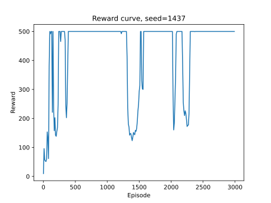

# 作业 4：强化学习

## 2 Bellman Equation（25pt）

#### 1. 写出衰减系数为 $\gamma$ 的 MDP 中，策略 $\pi$ 的状态值函数 $V^{\pi}\left(s\right)$ 的定义。

在衰减系数为 $\gamma$ 的 MDP 中，策略 $\pi$ 的状态值函数 $V^{\pi}\left(s\right)$ 定义为从状态 $s$ 出发，按照策略 $\pi$ 选择动作所能获得的期望折扣累计奖励。

$$
V^{\pi}\left(s\right)=\mathbb{E}_{\pi}\left[G_{t}\middle\vert S_{t}=s\right]=\mathbb{E}_{\pi}\left[\sum_{t=0}^{\infty}\gamma^t R_{t}\middle|S_{t}=s\right]
$$

#### 2. 写出状态值函数 $V^{\pi}\left(s\right)$ 所符合的贝尔曼（Bellman）期望方程。

状态值函数 $V^{\pi}(s)$ 所符合的贝尔曼期望方程为：

$$
V^{\pi}(s)=\sum_{a\in\mathcal{A}}\pi\left(a\middle\vert s\right)\left(\mathcal{R}_{s}^{a}+\gamma\sum_{s'\in\mathcal{S}}\mathcal{P}_{ss'}^{a}V^{\pi}\left(s'\right)\right)
$$

#### 3. 考虑一个均匀随机策略 $\pi_{0}$ （以相同的概率选取所有动作），初始状态值函数 $V_{0}^{\pi_{0}}\left(A\right)=V_{0}^{\pi_{0}}\left(B\right)=V_{0}^{\pi_{0}}\left(C\right)=0$，请利用 2 中的贝尔曼期望方程，写出上述 MDP 过程中，迭代式策略评估进行一步更新的状态值函数 $V_{1}^{\pi_{0}}$ 。

由于初始状态值函数 $V_{0}^{\pi_{0}}\left(A\right)=V_{0}^{\pi_{0}}\left(B\right)=V_{0}^{\pi_{0}}\left(C\right)=0$ ，为了简便起见，以下式子忽略了 $\displaystyle\gamma\sum_{s'\in\mathcal{S}}\mathcal{P}_{ss'}^{a}V^{\pi}\left(s'\right)$ 项，因为其值为 0 。

$$
\begin{align*}
V_{1}^{\pi_{0}}\left(A\right)&=\mathcal{R}_{A}^{ab}&=-4&=-4\\
V_{1}^{\pi_{0}}\left(B\right)&=\frac{1}{2}\mathcal{R}_{B}^{ba}+\frac{1}{2}\mathcal{R}_{B}^{bc}&=\frac{1}{2}\times1+\frac{1}{2}\times2&=1.5\\
V_{1}^{\pi_{0}}\left(C\right)&=\frac{1}{2}\mathcal{R}_{C}^{ca}+\frac{1}{2}\mathcal{R}_{C}^{cb}&=\frac{1}{2}\times8+\frac{1}{2}\times0&=4
\end{align*}
$$

#### 4. 基于 3 中计算得到的 $V_{1}^{\pi_{0}}$ ，利用贪心法得到确定性策略 $\pi_{1}$ 。

根据 $V_{1}^{\pi_{0}}$ 的值，可以得到确定性策略 $\pi_{1}$ 如下：

$$
\begin{align*}
\pi_{1}\left(A\right)&=ab\\
\pi_{1}\left(B\right)&=bc\\
\pi_{1}\left(C\right)&=ca
\end{align*}
$$

## 3 $\mathrm{TD}\left(\lambda\right)$ & Eligibility Trace（附加题，10pt）

#### 1. 定义 $T\left(S_{1},S_{2}\right)=\begin{cases}1&\text{if }S_{1}=S_{2}\\0&\text{if }S_{1}\ne S_{2}\end{cases}$ ，在后向视角中，状态 $s$ 在第 $t$ 步的价值更新量为 $\Delta V_{t}^{\text{back}}\left(s\right)=\alpha\delta_{t}E\left(s\right)$ 。请证明：对于整条轨迹，状态 $s$ 的价值更新量 $\displaystyle\Delta V_{\text{all}}^{\text{back}}\left(s\right)=\sum_{t=0}^{T-1}\Delta V_{t}^{\text{back}}\left(s\right)=\alpha\sum_{t=0}^{T-1}I\left(s,S_{t}\right)\sum_{k=t}^{T-1}\left(\gamma\lambda\right)^{k-t}\delta_{k}$ 。

$$
\Delta V_{\text{all}}^{\text{back}}\left(s\right)=\sum_{t=0}^{T-1}\Delta V_{t}^{\text{back}}\left(s\right)=\alpha\sum_{t=0}^{T-1}\delta_{t}E\left(s\right)
$$

由于在更新时，对于第 $t$ 步，我们遇到状态 $S_{t}$ ，于是更新它的资格迹：

$$
E\left(S_{t}\right)=E\left(S_{t}\right)+1
$$

再对所有状态 $S$ 的资格迹进行衰减：

$$
E\left(S\right)=\gamma\lambda E\left(S\right)
$$

故而有

$$
E\left(s\right)=\sum_{k=t}^{T-1}I\left(s,S_{k}\right)\left(\gamma\lambda\right)^{k-t}
$$

于是

$$
\begin{align*}
\Delta V_{\text{all}}^{\text{back}}\left(s\right)&=\alpha\sum_{t=0}^{T-1}\delta_{t}E\left(s\right)\\
&=\alpha\sum_{t=0}^{T-1}\delta_{t}\sum_{k=t}^{T-1}I\left(s,S_{k}\right)\left(\gamma\lambda\right)^{k-t}\\
&=\alpha\sum_{t=0}^{T-1}I\left(s,S_{t}\right)\sum_{k=t}^{T-1}\left(\gamma\lambda\right)^{k-t}\delta_{k}
\end{align*}
$$

#### 2. 在前向视角中，状态 $s$ 在第 $t$ 步的价值更新量为 $\Delta V_{t}^{\text{for}}\left(s\right)=I\left(s,S_{t}\right)\alpha\left(G_{t}^{\lambda}−V\left(S_{t}\right)\right)$ 。现在，我们需要将 $G_{t}^{\lambda}$ 展开为用 $R_{t}$，$V\left(S_{t}\right)$ 描述的表达式，并得出 $\Delta V_{t}^{\text{for}}\left(s\right)$ 使用 $R_{t},V\left(S_{t}\right)$ 描述的表达式。（提示：可依次算出每一项的系数）

由于

$$
G_{t}^{\left(n\right)}=R_{t+1}+\gamma R_{t+2}+\cdots+\gamma^{n-1}R_{t+n}+\gamma^{n}V\left(S_{t+n}\right)
$$

以及

$$
G_{t}^{\lambda}=\left(1-\lambda\right)\sum_{n=1}^{T-t-1}\lambda^{n-1}G_{t}^{\left(n\right)}+\lambda^{T-t-1}G_{t}^{\left(T-t\right)}
$$

所以

$$
G_{t}^{\lambda}=\sum_{n=1}^{T-t}\left(\gamma\lambda\right)^{n-1}R_{t+n}+\sum_{n=1}^{T-t-1}\gamma^{n}\left(1-\lambda\right)\lambda^{n-1}V\left(S_{t+n}\right)+\gamma^{T-t}\lambda^{T-t-1}V\left(S_{T}\right)
$$

所以

$$
\begin{align*}
\Delta V_{t}^{\text{for}}\left(s\right)&=I\left(s,S_{t}\right)\alpha\left(G_{t}^{\lambda}-V\left(S_{t}\right)\right)\\
&=I\left(s,S_{t}\right)\alpha\left(\sum_{n=1}^{T-t}\left(\gamma\lambda\right)^{n-1}R_{t+n}+\sum_{n=1}^{T-t-1}\gamma^{n}\left(1-\lambda\right)\lambda^{n-1}V\left(S_{t+n}\right)+\gamma^{T-t}\lambda^{T-t-1}V\left(S_{T}\right)-V\left(S_{t}\right)\right)
\end{align*}
$$

#### 3. 在前向视角中，对于整条轨迹，状态 $s$ 的价值更新量为 $\Delta V_{\text{all}}^{\text{for}}\left(s\right)=\sum_{t=0}^{T-1}\Delta V_{t}^{\text{for}}\left(s\right)$ 。请证明： $\Delta V_{\text{all}}^{\text{for}}\left(s\right)=\Delta V_{\text{all}}^{\text{back}}\left(s\right)$ 。

要证明

$$
\Delta V_{\text{all}}^{\text{for}}\left(s\right)=\Delta V_{\text{all}}^{\text{back}}\left(s\right)
$$

由前两问可知

$$
\begin{align*}
\Delta V_{\text{all}}^{\text{back}}\left(s\right)&=\alpha\sum_{t=0}^{T-1}I\left(s,S_{t}\right)\sum_{k=t}^{T-1}\left(\gamma\lambda\right)^{k-t}\delta_{k}\\
\Delta V_{\text{all}}^{\text{for}}\left(s\right)&=\alpha\sum_{t=0}^{T-1}I\left(s,S_{t}\right)\left(G_{t}^{\lambda}−V\left(S_{t}\right)\right)
\end{align*}
$$

故而只需要证明

$$
\sum_{k=t}^{T-1}\left(\gamma\lambda\right)^{k-t}\delta_{k}=G_{t}^{\lambda}−V\left(S_{t}\right)
$$

由于

$$
\delta_{t}=R_{t+1}+\gamma V\left(S_{t+1}\right)-V\left(S_{t}\right)
$$

所以

$$
\begin{align*}
\sum_{k=t}^{T-1}\left(\gamma\lambda\right)^{k-t}\delta_{k}&=\sum_{n=1}^{T-t}\left(\gamma\lambda\right)^{n-1}\delta_{t+n-1}\\
&=\sum_{n=1}^{T-t}\left(\gamma\lambda\right)^{n-1}\left(R_{t+n}+\gamma V\left(S_{t+n}\right)-V\left(S_{t+n-1}\right)\right)\\
&=\sum_{n=1}^{T-t}\left(\gamma\lambda\right)^{n-1}R_{t+n}+\sum_{n=1}^{T-t-1}\gamma^{n}\left(1-\lambda\right)\lambda^{n-1}V\left(S_{t+n}\right)+\gamma^{T-t}\lambda^{T-t-1}V\left(S_{T}\right)-V\left(S_{t}\right)\\
&=G_{t}^{\lambda}-V\left(S_{t}\right)
\end{align*}
$$

所以上式成立。

## 4 Q-Learning & Sarsa（25pt）

#### 1. 补充 `./algorithms/QLearning` 函数，填入 1 行代码实现 Q-learning 算法；

```python
Q[s][a] = Q[s][a] + lr * (reward + gamma * np.max(Q[nexts]) - Q[s][a])
```

#### 2. 补充 `./algorithms/Sarsa` 函数，实现 Sarsa 算法；(可参考提供的 Q-learning 算法)

```python
Q = np.zeros((env.observation_space.n, env.action_space.n))
episode_reward = np.zeros((num_episodes,))
for i in range(num_episodes):
    tmp_episode_reward = 0
    s, info = env.reset()
    if np.random.rand() > e:
        a = np.argmax(Q[s])
    else:
        a = np.random.randint(env.action_space.n)
    while True:
        nexts, reward, terminated, truncated, info = env.step(a)
        done = terminated or truncated
        if np.random.rand() > e:
            nexta = np.argmax(Q[nexts])
        else:
            nexta = np.random.randint(env.action_space.n)
        Q[s][a] = Q[s][a] + lr * (reward + gamma * Q[nexts][nexta] - Q[s][a])
        tmp_episode_reward += reward
        s, a = nexts, nexta
        if done:
            break
    episode_reward[i] = tmp_episode_reward
    print(f"Total reward until episode {i + 1}: {tmp_episode_reward}")
    if i % 10 == 0:
        e *= decay_rate
return Q, episode_reward
```

#### 3. 完成两种不同算法迭代步长 `lr` 取值下的对比实验，绘制不同步长下的学习曲线图，并简要分析结果。（提示：`main.py` 的注释中有相关绘图代码）

| 步长  |                  学习曲线图                   |
| :---: | :-------------------------------------------: |
| 0.001 |  |
| 0.005 |  |
| 0.01  |   |
| 0.05  |   |
|  0.1  |    |
|  0.3  |    |
|  0.5  |    |
|  0.8  |    |
|  1.0  |    |

从图中可以看到，迭代步长 `lr` 过小时，学习速度较慢，学习曲线上升速度较慢，但是学习曲线的波动较小；迭代步长 `lr` 过大时，学习曲线难以收敛，波动较大；迭代步长 `lr` 适中时，学习曲线上升速度适中，波动较小。

#### 4. 如果修改 `main.py:17` 处的代码，将每步 −0.03 的惩罚值增大到 −0.3，算法学到的策略会有何不同？请简要分析原因。

可以观察到小人会非常迫切地想要到达终点，同时很容易滑入冰洞。这是因为每步的惩罚太大，与滑入冰洞的惩罚相比差距更小，因此小人更加不在乎滑入冰洞的惩罚，而更加迫切地想要到达终点。

| 步长  |                 学习曲线图                  |
| :---: | :-----------------------------------------: |
|  0.1  |  |

观察学习曲线可以看到，总奖励始终保持在一个较低的值，学习到的策略较为有限。

## 5 REINFORCE & AC（50pt）

#### 1. 补充 `REINFORCE` 类中的 `learn` 函数，实现 REINFORCE 算法。

```python
G = []
cumulative = 0
for reward in reversed(self.rewards):
    cumulative = reward + GAMMA * cumulative
    G.insert(0, cumulative)
G = torch.tensor(G, dtype=torch.float32)
G = (G - G.mean()) / (G.std() + 1e-8)
for action_prob, action, reward in zip(self.action_probs, self.actions, G):
    log_prob = torch.log(action_prob.squeeze(0)[action])
    loss.append(-log_prob * reward)
```

#### 2. 补充 `TDActorCritic` 类中的 `learn` 函数，实现 TD Actor-Critic 算法。value 的损失函数已经预先实现了，只需要实现 policy 的损失函数即可。代码中 $\text{td\_target}=R_{t+1}+\gamma v_{π}\left(S_{t+1}\right)$ 。

```python
v_s = self.ac.v(self.states)
v_s_prime = self.ac.v(self.states_prime) * self.done
td_target = self.rewards + GAMMA * v_s_prime
delta = td_target - v_s
action_log_probs = torch.log(self.action_probs.gather(1, self.actions))
policy_loss = -(action_log_probs * delta.detach()).mean()
```

#### 3. 请绘制两个模型的训练曲线，包括训练过程的损失函数的变化和最终奖励值，并分析训练稳定性及收敛效率。由于强化学习的不稳定性，你的结果需要基于至少 3 个种子。

|     模型      |  种子  |                          损失函数曲线                          |                            奖励值曲线                            |
| :-----------: | :----: | :------------------------------------------------------------: | :--------------------------------------------------------------: |
|   REINFORCE   |   0    |           |           |
|   REINFORCE   |  1437  |        |        |
|   REINFORCE   | 114514 |      |      |
| TDActorCritic |   0    |       |       |
| TDActorCritic |  1437  |    |    |
| TDActorCritic | 114514 |  |  |

由两个模型的训练曲线可以看到，REINFORCE 算法的训练过程中损失函数波动较大，奖励值曲线波动较大，收敛效率较低；TD Actor-Critic 算法的训练过程中损失函数波动较小，奖励值曲线波动较小，收敛效率较高。

---

成绩：100

评语：3 +5
